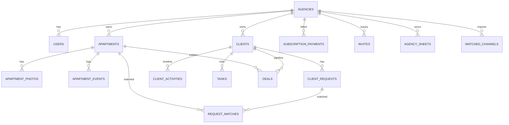
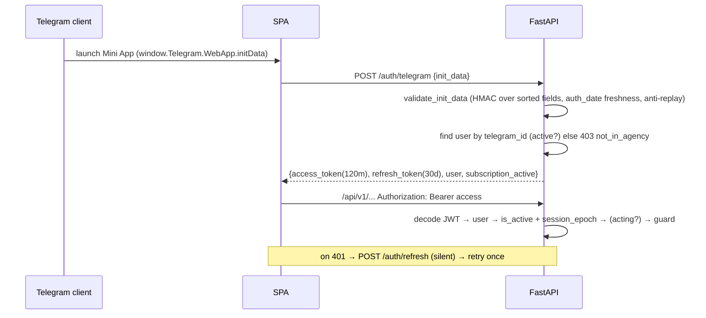

# Realty‑AI — Full System Reverse‑Engineering & Architecture Audit

> **Scope:** entire codebase (backend + frontend + infra), not a single feature.
> **Method:** files read directly and cross‑referenced (routes → services → repositories → models, config, auth, scheduler, Docker/Caddy). Where a claim is not directly verified from source it is marked **[inferred]**.
> **Date:** 2026‑07‑01 · **Reviewer role:** incoming Lead Architect.
>
> **⚡ Update 2026‑07‑10 — user‑centric pivot (LIVE).** This audit predates the pivot. Since then: a personal‑account role **`user`** and self‑serve registration replaced the "login → 403 if not in agency" flow (unknown Telegram users now get a personal account and a personal hub); multi‑agency membership landed via the **`agency_memberships`** table; a **`superadmin`** router exposes a platform users view (objects only, clients private). Counts below are refreshed inline: **14 routers · migrations 0001→0039 · ≈200 tests**. See `TECHNICAL_DOCUMENTATION.md` (sections flagged **[pivot]**) for the authoritative current state.

---

## 0. Confidence & evidence base

| Area | Confidence | Basis |
|---|---|---|
| Backend architecture, auth, guards, config, startup | **High** | `main.py`, `config.py`, `core/dependencies.py`, `core/security.py`, `services/auth_service.py` read in full |
| API surface | **High** | grep of all `@router.*` across `app/api/routes` (~90 endpoints) |
| Data model | **High/Med** | model files enumerated; `agency.py`, `user.py`, `apartment.py`, `client*.py` read; a few field lists **[inferred]** from usage |
| Scheduler / background jobs | **High** | `services/scheduler.py` read in full |
| Frontend architecture | **High** | `App.tsx`, `api.ts`, `store.tsx`, `nav.tsx`, `components/ui.tsx`, `i18n.ts`, several screens read |
| Infra / DevOps | **High** | `docker-compose.yml`, `frontend/Caddyfile` read; deploy flow from project history |
| Security posture | **High/Med** | code + prior security reviews; some remediations tracked as done |

---

## PHASE 1 — Project Overview

### 1.1 Purpose & business goals
**Realty‑AI** is a **multi‑tenant SaaS for real‑estate agencies in Uzbekistan**, delivered as a **Telegram Mini App**. The platform owner ("superadmin") rents isolated "agencies" to customers; each agency manages its **property listings**, **team**, **client base (mini‑CRM)**, **deals**, and cross‑agency **MLS** sharing. Monetization = **per‑agency subscription** (manual, tracked by superadmin).

Core value propositions:
- **AI‑assisted data entry** (import a listing from a link / bulk‑import a public Telegram channel; Gemini/OpenRouter parse free‑text into structured fields).
- **Auto‑matching** of new listings to saved client requests.
- **MLS**: agencies optionally share listings platform‑wide with hidden owner contact.
- **Google Sheets 2‑way sync** and **Excel export**.

### 1.2 Primary user journeys
1. **Agent/Admin**: opens Mini App in Telegram → auto‑login via `initData` → Home dashboard → add/search listings, manage clients & requests, review auto‑matches, create deals, share a listing to a client via bot.
2. **Superadmin**: manages agencies (create by link/draft, subscription, freeze/delete), monitors engagement, reviews the MLS pool, operates personal agencies via **acting** context.
3. **New employee**: opens invite link → `initData` login now yields a **personal account** (no 403) → app calls `/invites/redeem` with the code → an `agency_memberships` row is created → becomes agent in that agency (may still belong to others).

### 1.3 Architecture style
**Modular monolith**, cleanly **layered**:

```
Telegram client ──HTTPS──► ngrok ──► Caddy (edge: TLS termination via tunnel, CSP, /api proxy, SPA static)
                                          │
                                          ├── /            → React SPA (Vite build, served static)
                                          └── /api/*,/health→ FastAPI (uvicorn)
                                                                │ layered:
                                                                │  routes (HTTP) → services (business) → repositories (data) → SQLAlchemy models → PostgreSQL
                                                                ├── background daemon threads (scheduler)
                                                                ├── local disk (photos volume) + secrets volume
                                                                └── external: Telegram Bot API · Gemini/OpenRouter · Google Sheets OAuth · Playwright/Chromium
```

### 1.4 System boundaries & external integrations
| Integration | Purpose | Config | Failure mode |
|---|---|---|---|
| **Telegram Bot API** | Auth (`initData` HMAC), push notifications, share listings | `BOT_TOKEN` | login returns coded error if unset |
| **Google Gemini** | AI field extraction from listing text | `GEMINI_API_KEY`, `IMPORT_AI_MODEL` (`gemini-2.5-flash-lite`) | falls back to OpenRouter / manual |
| **OpenRouter** | Fallback AI provider (free models) | `OPENROUTER_API_KEY`, provider order `IMPORT_AI_PROVIDERS` | graceful degrade |
| **Google Sheets** | 2‑way listing sync (OAuth `drive.file`) | `GOOGLE_CLIENT_ID/SECRET`, tokens Fernet‑encrypted in DB | coded errors, 45 s loop |
| **Playwright/Chromium** | Render JS‑heavy listing pages for import | `IMPORT_BROWSER_RENDER` | silent fallback to httpx |
| **ngrok** | Fixed public HTTPS domain for the Mini App | `NGROK_AUTHTOKEN`, `NGROK_DOMAIN` | app unreachable |

### 1.5 Startup sequence (`main.py` lifespan)
```
uvicorn boot
 └─ FastAPI(lifespan)
     ├─ run_migrations()               # Alembic upgrade head (app/db/migrate.py)
     ├─ bootstrap_superadmin()         # ensure_superadmins() self‑heals owner(s) from SUPERADMIN_TELEGRAM_ID(S)
     ├─ os.makedirs(photos_dir)        # ensure photo volume dir
     └─ start_scheduler()              # 4 daemon threads (see Phase 10)
 middleware chain (outer→inner): db‑retry wrapper · body‑size limit · LanguageMiddleware
 exception handlers: RequestValidationError(422 localized) · Exception(500 → internal_error + alert)
```

### 1.6 Request flow (authenticated API call)
```
Client fetch(/api/v1/...) with Authorization: Bearer <JWT>, X‑Lang
 → Caddy @backend → reverse_proxy backend:8000
 → LanguageMiddleware sets lang ContextVar
 → route dependency get_current_user → decode JWT → load User → check is_active + session_epoch → (maybe) ActingUser
 → require_* guard (role + subscription)
 → route handler → service (business rules, ownership checks) → repository (agency‑scoped query) → DB
 → Pydantic response_model serialization → JSON
 (unexpected error → 500 handler → report_error → superadmin bot alert)
```

### 1.7 Rendering & state flow (frontend)
```
main.tsx → App (ActingProvider, NavProvider, store)
 phase machine: loading → open("Open in Telegram") | join | ready | suspended
 ready → Shell(header + AnimatePresence<RouteView> + BottomTabs)
 RouteView switch(route.name) → lazy(screen) inside <Suspense>
 state: React context store (auth user, lang, theme, toasts) + local useState per screen; server state fetched imperatively via api()
```

---

## PHASE 2 — Application Structure (module map)

### 2.1 Repository tree (top level)
```
Realty-AI/
├─ backend/                 FastAPI service
│  ├─ app/
│  │  ├─ main.py            app factory, lifespan, middleware, health
│  │  ├─ config.py          pydantic-settings (all env)
│  │  ├─ api/
│  │  │  ├─ router.py       aggregates 14 routers under /api/v1 (incl. superadmin [pivot])
│  │  │  └─ routes/         auth, agencies, apartments, clients, dictionaries,
│  │  │                     exports, imports, invites, mls, photos, settings, sheets, team
│  │  ├─ core/              security, errors, dependencies (guards), subscription,
│  │  │                     ratelimit, crypto, monitoring, browser_render
│  │  ├─ services/          business logic (apartment, client, agency, auth, photo,
│  │  │                     sheets, telegram, telegram_channel, listing_import,
│  │  │                     base_import, dictionary, member, scheduler, ...)
│  │  ├─ repositories/      data access (agency, apartment, client, user, payment,
│  │  │                     audit, dictionary, invite, ...)
│  │  ├─ db/                base, session, migrate, retry, models/ (19)
│  │  └─ schemas/           Pydantic I/O models
│  ├─ alembic/versions/     0001..0039 migrations
│  ├─ tests/                ≈200 tests (pytest, SQLite in‑memory)
│  ├─ requirements.txt · Dockerfile
├─ frontend/                React + Vite SPA
│  ├─ src/                  App.tsx, api.ts, store.tsx, nav.tsx, i18n.ts, telegram.ts,
│  │                        utils.ts, types.ts, components/ui.tsx, screens/*
│  ├─ public/fonts/         Manrope woff2 (local, CSP‑safe)
│  ├─ Caddyfile · Dockerfile · tailwind.config.js · index.html
├─ docker-compose.yml       db, backend, backup, web, ngrok
├─ scripts/auto_backup.sh · backups/
```

### 2.2 Layer responsibilities
| Layer | Responsibility | May depend on | Must NOT |
|---|---|---|---|
| `api/routes` | HTTP shape, auth deps, status codes | services, schemas, core | contain business rules / raw SQL |
| `services` | business rules, invariants, cross‑entity orchestration, external calls | repositories, other services, core | know about HTTP `Request` |
| `repositories` | agency‑scoped queries, CRUD | models, session | contain business rules |
| `core` | security, errors, guards, crypto, rate‑limit, monitoring | config, repos (guards only) | — |
| `db/models` | SQLAlchemy ORM tables | base | import services |
| `schemas` | Pydantic validation/serialization + field validators | apartment enums | DB access |

**Observed problems / smells (structure):**
- `client_service.py` is very large (matching, requests, activities, tasks, deals, hints, digest, notify) — a **god‑service**; candidate to split (`matching_service`, `deal_service`, `activity_service`).
- Some services import each other laterally (`client_service` ↔ `apartment_service._display_name/_attach_creators`) — **cohesion leak** (display helpers live in apartment_service but are reused by clients).
- Lazy imports inside `scheduler.py` (`client_service`, `sheets_service`, `telegram_channel_service`) to avoid circular imports — a signal of **latent circular dependency** between services.
- **Overlapping "list" logic**: `list_clients` / `list_matches` filtering (archived, owner) repeated across repo/service — mostly consolidated but historically duplicated.
- **Dead/near‑dead**: `ensure_superadmin` (single) kept only for back‑compat; `photo_storage_backend="s3"` branch **[inferred]** not implemented (local only).

---

## PHASE 3 — User Roles & Permission Matrix

### 3.1 Roles (confirmed from `user.py` CheckConstraint + guards)
| Role | `agency_id` | Notes |
|---|---|---|
| `superadmin` | NULL | platform owner(s); multiple allowed (`SUPERADMIN_TELEGRAM_IDS`); self‑healed on boot |
| `agency_admin` | set | agency admin; `is_owner=True` ⇒ **main admin** (manages team/invites/roles) |
| `agent` | set | regular employee; sees only **own** clients/deals |
| **ActingUser** (synthetic) | acting agency | superadmin operating **inside a personal agency**; role reported as `agency_admin`, `is_owner=True`, `real_role=superadmin`. **Not an ORM row** — read‑only. |

**Hierarchy:** `superadmin` ⟶ (acting) ⟶ `agency_admin (owner)` ⟶ `agency_admin` ⟶ `agent`. No DB‑level role inheritance; enforced procedurally by guards.

### 3.2 Guards (dependency injection)
- `get_current_user` — decode JWT, load user, check `is_active`, check `session_epoch` (instant revoke), resolve **acting** context (re‑verifies ownership from DB each request).
- `require_superadmin` — `role=="superadmin"` (ActingUser fails → platform endpoints closed while acting; correct).
- `require_agency_member` / `require_agency_admin` / `require_agency_owner` — role + `agency_id` + **subscription gate** (`_ensure_subscription_active`; personal agencies bypass).

### 3.3 Permission matrix (● allowed · ○ forbidden · ◐ own‑only)
| Capability | superadmin | admin(owner) | admin | agent |
|---|:--:|:--:|:--:|:--:|
| Login (initData) | ● | ● | ● | ● |
| CRUD listings | ○¹ | ● | ● | ● |
| Delete/restore listing | ○¹ | ● | ● | ● |
| Clients & requests | ○¹ | ● (all) | ● (all) | ◐ (own) |
| Deals / activities / tasks | ○¹ | ● (all) | ● (all) | ◐ (own) |
| MLS matches (own view) | ○¹ | ● | ● | ● |
| **MLS pool (whole platform)** | ● | ○ | ○ | ○ |
| Google Sheets / Excel | ○¹ | ● | ● | ● (export) |
| Team: view | ○ | ● | ● | ● |
| Team: invite / remove / revoke | ○ | ● | ○ | ○ |
| Team: change roles / transfer owner | ○ | ● | ○ | ○ |
| Dictionaries (districts/types) write | ○ | ● (admin) | ● (admin) | ○ |
| Agencies mgmt (create/sub/freeze/delete) | ● | ○ | ○ | ○ |
| Agency payments / delete payment | ● | ○ | ○ | ○ |
| Personal agencies / enter (acting) | ● | — | — | — |

¹ Superadmin has no agency ⇒ agency‑scoped endpoints reject (`forbidden_member_only`). To act on listings they must **enter a personal agency** (acting).

### 3.4 Edge cases / risks (authorization)
- **Agent visibility model** relies on `created_by == user.id` (`_owner_filter`, `_load_client_for_user`). Admin sees all (`_can_see_all`). ✔ consistent.
- **ActingUser must never be committed** — enforced by convention/comment only; a future `db.add(current_user)` would corrupt the superadmin row. **Risk: no compile‑time guard.**
- **Privilege escalation surface checked:** `agent_id`/`owner_id` assignment validated to same agency (`_valid_agent_id`, `invalid_owner`) — fixed in prior audit; deal/client agent must be active same‑agency.
- **`require_agency_owner` used for imports** (bulk TG import is owner‑only) — consistent but note agents cannot bulk‑import.

---

## PHASE 4 — Features (catalog)

| # | Feature | Frontend | Backend | Key endpoints | Notes / risks |
|---|---|---|---|---|---|
| 1 | Telegram login + silent refresh | `App.tsx`, `api.ts` | `auth_service`, `security` | `POST /auth/telegram`, `/auth/refresh`, `GET /auth/me` | anti‑replay; 401→auto reauth |
| 2 | Listings CRUD + archive/restore/permanent | `Apartments.tsx` | `apartment_service` | `/apartments` (+ `/archived`, `/{id}/restore`, `/permanent`) | soft delete `deleted_at`; status×deal_type invariant |
| 3 | Photos (upload/import/serve/delete) | `Apartments.tsx` | `photo_service` | `/apartments/{id}/photos*`, `GET /photos/{key}` | files on volume; **public read** by design; SSRF‑guarded import |
| 4 | Search + duplicates | `Apartments.tsx` | `apartment_service`, `duplicate_service` | `/apartments`, `/duplicates`, `/duplicates/dismiss` | lenient‑missing search |
| 5 | Client base (mini‑CRM) | `Clients.tsx` | `client_service` | `/clients*` (+ archived, restore) | agent sees own; archived restorable |
| 6 | Requests + auto‑matching | `Clients.tsx` | `client_service` matching | `/clients/{id}/requests`, `/matches*` | scheduler tick 120 s; scored matches |
| 7 | Activities / tasks / deals (+delete) | `Clients.tsx` | `client_service` | `/clients/{id}/activities|tasks|deals`, deletes | full CRUD (delete added) |
| 8 | MLS sharing + owner pool | `Apartments.tsx`, `Superadmin.tsx` | `apartment_repo.search_shared`, `mls_service` | `/mls/pool`, match `source=mls` | owner contact/address/agent hidden |
| 9 | AI listing import (link) | `Apartments.tsx` | `listing_import_service`, `browser_render` | (via add flow) | Gemini→OpenRouter; SSRF guard; Playwright fallback |
| 10 | Bulk / background TG channel import | `Settings.tsx` | `telegram_channel_service` | `/imports/telegram/scan`, `/watches` | owner‑only; dedup by source_link; auto‑import 600 s |
| 11 | Base import (.xlsx/.csv + AI mapping) | `Settings.tsx` | `base_import_service` | `/imports/base/analyze|commit` | file re‑sent on commit (not stored) |
| 12 | Google Sheets 2‑way sync | `Settings.tsx` | `sheets_service` | `/sheets/*` | OAuth `drive.file`; LWW; 45 s loop |
| 13 | Excel export | `Settings.tsx` | `exports` | `/exports/excel`, signed file link | token‑signed URL |
| 14 | Team & invites | `Team.tsx`, `Invites.tsx` | `member_service`, `invite_service` | `/team/*`, `/invites/*` | owner‑gated; session revoke |
| 15 | Agencies mgmt + monitoring | `Superadmin.tsx` | `agency_service`, `agency_usage_service` | `/agencies/*` | draft/activation link; usage/activity |
| 16 | Personal agencies + acting | `Superadmin.tsx` | `auth_service`, `agencies` | `/agencies/mine`, `/{id}/enter` | acting JWT claim `act_as_agency_id` |
| 17 | Deals analytics / dashboards | `Home.tsx`, `Analytics.tsx`, `Superadmin.tsx` | `client_service`, `apartment_service` | `/clients/stats`, `/apartments/analytics|timeseries` | CSS charts (a11y‑light) |
| 18 | Notifications (in‑app + bot digest) | `Clients.tsx` | `client_service`, `telegram_service` | `/clients/notify`, matches summary | instant/daily; scheduler digest |
| 19 | Subscription lifecycle | — | `scheduler`, `agency_service` | `/agencies/{id}/subscription` | warn + auto‑expire |

---

## PHASE 5 — Database (data model)

### 5.1 Tables (19 models)
| Table | Purpose | Key fields | Soft‑delete | Owner (tenant) |
|---|---|---|---|---|
| `agencies` | tenant | status(check trial/active/frozen/expired/pending), subscription_expires_at, owner_telegram_id, last_display_number, contact_phone, client_phone | status=`archived`? no (dropped in 0004) | self |
| `users` | people | telegram_id(uniq), role(check), is_owner, is_active, session_epoch, match_notify | is_active flag | agency_id FK→agencies **ON DELETE CASCADE** |
| `apartments` | listings | display_id, status, deal_type, rent_period, price, district/address, shared_mls, source*, created_by | `deleted_at` | agency_id |
| `apartment_photos` | photo meta | storage_key, sort_order | — | agency_id/apartment |
| `apartment_events` | listing audit trail | action, note, user | — | agency/apartment |
| `clients` | CRM contacts | name, phone, priority, source, muted, status(active/archived) | status=`archived` | agency_id, created_by |
| `client_requests` | saved searches | criteria (types/districts/rooms/area/price…), status(active/fulfilled/cancelled) | hard delete | agency/client |
| `request_matches` | match join | request↔apartment, status(new/seen/offered/dismissed), score, reasons, source(own/mls) | hard delete | agency |
| `client_activities` | timeline | kind(call/show/meeting/message/note/price_change), note, created_by | hard delete | agency/client |
| `tasks` | client tasks | title, deadline, status(open/done), kind(manual/auto), done_at | hard delete | agency/client |
| `deals` | pipeline | stage, price, commission, agent_id, apartment_id, seller_agency_id, closed_at | hard delete | agency/client |
| `dictionaries` | districts/types | category, value | — | agency |
| `invites` | join codes | code, role, expires_at, used_at | used_at | agency |
| `subscription_payments` | billing ledger | action, days, amount, currency, note, created_by_telegram_id | hard delete (now) | agency |
| `audit_log` | agency audit | action, actor, ip | — | agency |
| `agency_sheets` | Sheets link | spreadsheet id, encrypted tokens, snapshot | — | agency |
| `watched_channels` | TG auto‑import | channel, last_post_id, enabled, share_mls | — | agency |
| `duplicate_dismissals` | dedup memory | key | — | agency |

### 5.2 Relationships (ER, simplified)


### 5.3 Data‑model observations
- **Tenant isolation** = `agency_id` on nearly every table + repository‑level `where agency_id == ...`. Only DB‑level FK cascade is `users.agency_id → agencies ON DELETE CASCADE`; most others rely on **application‑level scoping** rather than FKs. **[risk]** cross‑tenant leakage is prevented in code, not schema — a missing `agency_id` filter anywhere = tenant breach. Prior audits verified the hot paths.
- **Display IDs** use a per‑agency counter `agencies.last_display_number` (atomic increment) — avoids a "service agent" hack; good.
- **Soft delete is inconsistent**: apartments use `deleted_at`; clients use `status='archived'`; requests/deals/tasks/activities/matches are **hard‑deleted**. Intentional (history vs disposable) but worth documenting as a rule.
- **Audit fields**: `created_at/updated_at` broadly present; `created_by` on apartments/clients/activities. No global "updated_by".
- **CheckConstraints** exist for `agencies.status`, `users.role`, and (per migrations) status×deal_type — cross‑field DB constraints for listings were **deferred** (enforced at API layer via Literal + service guard).
- **Migrations**: 39 linear Alembic revisions (0001→0039), applied automatically at boot (`run_migrations`). Additive discipline is strong. No down‑migrations exercised in prod. **[pivot]** `0035` adds `agency_memberships`; `0038`/`0039` add user profile fields and the `user` role.

---

## PHASE 6 — API (endpoint inventory)

**Auth model:** all `/api/v1/*` except `POST /auth/telegram`, `POST /auth/refresh`, and the OAuth/callback + public photo endpoints require `Authorization: Bearer` (JWT). Errors are localized (`AppError.detail`).

### 6.1 By router (≈90 endpoints)
- **auth** (`/auth`): `POST /telegram` (login), `POST /refresh`, `GET /me`.
- **agencies** (`/agencies`, superadmin): `POST ""`, `POST /draft`, `GET ""`, `GET /usage`, `GET /mine`, `POST /mine`, `POST /{id}/enter`, `PATCH /{id}`, `DELETE /{id}`, `POST /{id}/admin`, `POST /{id}/subscription`, `GET /payments/summary`, `GET /{id}/payments`, `DELETE /{id}/payments/{pid}`, `GET /{id}/audit`, `GET /{id}/activity`, `GET/POST/DELETE /{id}/activation`.
- **apartments** (`/apartments`, member): create/list/`archived`/`stats`/`duplicates`(+dismiss)/`analytics`/`timeseries`/`agent/{id}/activity`/`similar`/`import` + `/{id}` get/patch/`status`/delete/`restore`/`permanent`/`share`/`share-prepare`/`events`.
- **clients** (`/clients`, member): CRUD + `matches`(+summary/seen/{id}/status) + `stats` + `notify` + `requests/{id}`(patch/delete/rescan) + `tasks`(list/patch/delete) + `deals`(list/patch/delete) + `/{id}` get/patch/delete + `/{id}/requests|activities|tasks|deals|hints` (+ activity delete).
- **dictionaries** (`/dictionaries`, admin write): get/post/patch/delete.
- **exports** (`/exports`): `POST /excel`, `GET /excel/file` (signed).
- **imports** (`/imports`, owner): `base/analyze`, `base/commit`, `telegram/scan`, `telegram/watches` (list/add/delete).
- **mls** (`/mls`, superadmin): `GET /pool`.
- **invites** (`/invites`): create/list/delete + `redeem`.
- **settings** (`/agency`): `GET/PATCH /settings`.
- **photos**: `GET /apartments/{id}/photos`, upload/import/delete, `GET /photos/{key}` (**public**).
- **sheets** (`/sheets`): connect, `oauth/callback`, status, push/pull/…, disconnect.
- **team** (`/team`, owner): list/audit/patch/delete/revoke/owner‑transfer.

### 6.2 Cross‑cutting endpoint concerns
- **Route ordering** in `clients.py`/`apartments.py` carefully places literal paths (`/matches`, `/tasks`, `/stats`) **before** `/{id}` to avoid param capture — fragile but correct; documented in comments.
- **Side effects**: `matches/seen` (POST on list open) mutates on read; `/enter` mints an acting JWT; subscription actions append payment rows; import endpoints create apartments + fetch external URLs.
- **Performance hot spots**: `/mls/pool` (cross‑agency scan), matching endpoints, `/agencies/usage` (per‑agency aggregation), Sheets sync.

---

## PHASE 7 — Authentication & Authorization

### 7.1 Flow (sequence)


### 7.2 Mechanisms (confirmed)
- **initData validation**: HMAC‑SHA256 with `secret_key = HMAC("WebAppData", bot_token)`; accepts both `signature`‑included and excluded check‑strings; `hmac.compare_digest`; `auth_date` freshness (`init_data_max_age_seconds`=3600); **anti‑replay** by remembered hash (in‑proc, TTL to expiry). Deferred‑replay pattern for login→redeem is correct.
- **JWT**: HS256, secret from `JWT_SECRET` or auto‑generated & persisted to **separate `/secrets` volume** (not photos, not backups). Access 120 min; refresh 30 d, `type` claim distinguishes them.
- **Instant revocation**: `session_epoch` in both tokens; bump ⇒ all sessions invalid ("logout everywhere", disable/remove member).
- **Acting context**: JWT claim `act_as_agency_id`; **re‑verified from DB every request** (`owner_telegram_id == user.telegram_id`) — claim not trusted.

### 7.3 Security assessment (OWASP‑oriented)
| Area | Status |
|---|---|
| **A01 Broken Access Control** | Strong: role guards + subscription gate + agency scoping; acting re‑verified; agent own‑only. Residual: scoping is app‑level (no RLS). |
| **A02 Crypto Failures** | JWT HS256 fine; **Google tokens Fernet‑encrypted** (`APP_ENCRYPTION_KEY`); JWT secret off‑volume. |
| **A03 Injection** | SQLAlchemy parameterized throughout; no raw string SQL in app paths (only `text("SELECT 1")` health). |
| **A05 Misconfig** | `/docs` off in prod; DB not published; secrets from env; strict CSP. |
| **A07 AuthN Failures** | initData HMAC + freshness + anti‑replay; short access + revocable refresh. |
| **A08 SSRF** | `photo_service._assert_public_url` on **all** fetch paths incl. Playwright; redirects disabled per‑hop (fixed prior). |
| **A09 Logging/Monitoring** | 500s → superadmin bot alert; agency audit log; **no central log aggregation**. |
| **Rate limiting** | per‑route `rate_limit(...)` with trusted‑proxy‑aware client IP (X‑Forwarded‑For from right). |

**Weaknesses / watch‑items:** in‑proc anti‑replay & rate‑limit state (single‑instance assumption — horizontal scaling breaks both); JWT can’t be revoked before expiry except via epoch (acceptable); ActingUser‑commit foot‑gun; public photo endpoint = intentional info exposure (URLs unguessable `token_urlsafe`).

---

## PHASE 8 — Business Logic (rules & invariants)

- **Tenant isolation invariant**: every data query filters by `agency_id`; services take `agency_id` from the authenticated user, never from the body.
- **Ownership invariant (agents)**: agent sees/edits only rows where `created_by == user.id`; admins see all (`_can_see_all`).
- **Listing status × deal_type**: `_status_allowed_for_deal` — can’t mark "sold" on a rent listing or "rented" on a sale (create + set_status).
- **Matching (lenient‑on‑missing)**: `apartment_matches_request` treats missing numeric fields as pass; `score_match` weighs filled fields; **archived clients excluded** everywhere (fixed bug).
- **MLS blanking**: for `source=='mls'` matches and the owner pool, hide `owner_phone`, `address`, `comment`, `source*`, `created_by`, `created_by_name`; keep district/price/rooms + agency brand.
- **Subscription gate**: frozen/expired agency ⇒ 403 on member endpoints; **personal agencies (owner_telegram_id set) bypass** (always active).
- **Superadmin self‑healing**: on boot, configured IDs forced to active superadmin (agency_id NULL); non‑listed superadmins demoted.
- **Display ID monotonicity**: `last_display_number` atomic per agency.
- **Import dedup**: TG import skips already‑imported posts by `source_link`; base import file re‑sent on commit (not persisted).
- **Deal agent/owner validity**: `agent_id`/`owner_id` must be an active member of the same agency.
- **Error‑catalog invariant** (new): every `AppError("code")` must exist in `errors.MESSAGES` (guarded by `test_error_catalog`).

Hidden assumptions: **single backend instance** (in‑proc replay/rate‑limit/matching state); Telegram‑only auth (no email/password); currencies limited to USD/UZS/EUR.

---

## PHASE 9 — Frontend

- **Stack:** React 18 + TS + Vite 5 + Tailwind 3 + framer‑motion 11 + lucide‑react + qrcode.react. No router lib, no data‑fetch lib, no form lib.
- **Routing:** custom **stack navigator** (`nav.tsx`, `Route` union + `NavProvider`); `App.tsx` `RouteView` switch → **lazy‑loaded** screens under `<Suspense>` (code‑split; main bundle ~121 KB gz). Telegram BackButton wired to `nav.pop()`.
- **State:** React context store (`store.tsx`): auth user, lang, theme (synced to Telegram colorScheme), toasts. Server state fetched imperatively per screen (`api()`), no cache/invalidation layer.
- **Design system:** `components/ui.tsx` (Card, Button, Field/Input/Select, Badge, Segmented, Chips, Empty, Skeleton, Spinner…); indigo tokens in `index.css` + Tailwind mapping; local Manrope fonts (CSP‑safe); dark/light parity; `prefers-reduced-motion` honored.
- **i18n:** `i18n.ts` ru/uz/en dictionaries; `X‑Lang` header drives server‑side error localization.
- **Forms/validation:** hand‑rolled; errors surfaced via toasts (now with localized network fallback in `errText`). No inline field‑error binding / aria‑live association (improvement area).
- **Perf:** code‑splitting done; `background-attachment:fixed` + dot‑grid + backdrop blur (minor scroll cost); images `loading="lazy"` + `aspect-square` (CLS‑safe).
- **Dead/again‑check:** `SuspendedScreen` kept eager (used in phase machine); a couple of decorative emojis remain (🌐/✓/⚠) in match cards.

---

## PHASE 10 — Backend runtime

- **Controllers** = `api/routes` (thin). **Services** = business. **Repositories** = data. **DI** = FastAPI `Depends` (`get_db`, guards).
- **Background jobs** (`scheduler.py`, 4 daemon threads):
  1. `_loop` (6 h): expire subscriptions → warn owners → **photo orphan sweep** (24 h) → **auto‑tasks** "client silent N days" → **daily match digest**.
  2. `_sheets_loop` (45 s): 2‑way Google Sheets sync.
  3. `_autoimport_loop` (600 s): watched TG channels → new posts → AI → listings.
  4. `_matching_loop` (120 s): match new listings to active requests.
- **Transactions:** per‑request `Session` (`get_db`), explicit `db.commit()` in services; `db.flush()` in repos. **DB‑retry wrapper** (`install_db_retry`) transparently retries on dropped connections (server reboot resilience).
- **Error handling:** `AppError`(localized 4xx) · 422 localizer · 500 handler → `report_error` (bot alert) → `internal_error`. Body‑size middleware (413).
- **Caching/queues:** none (no Redis/Celery). Background work is in‑proc threads → **single‑instance coupling**.

---

## PHASE 11 — State Management

- **Frontend global:** context store (auth/lang/theme/toasts) + `acting` context. **Local:** per‑screen `useState`; lists re‑fetched on mount/refresh (no shared server cache) → occasional redundant requests, but simple and correct.
- **Auth token sync:** `api.ts` `tokenGetter/langGetter`, single‑flight silent refresh on 401 (`reauthInFlight`) prevents thundering‑herd reauth.
- **Backend "state":** in‑proc anti‑replay set, rate‑limit counters, scheduler throttles (`_last_sweep/_last_digest`) — **not shared across instances** (concurrency/scale caveat).
- **Race conditions:** matching + auto‑import + manual actions can interleave; dedup by `source_link` and idempotent status transitions mitigate. One‑time invite redeem is not fully atomic (pre‑existing, low risk for secret single‑use codes).

---

## PHASE 12 — Files & Storage

- **Uploads:** photos stored as files on `photos_data` volume (`/data/photos`), metadata (`storage_key`) in `apartment_photos`. Served via `GET /api/v1/photos/{key}` **publicly** (no auth) — required so Telegram can fetch images; keys are unguessable.
- **Backup separation:** **photos backed up separately** from DB dump; secrets on a **separate volume excluded from backups**.
- **Image processing:** Pillow (pinned ≥12.2 for CVEs); import from URLs SSRF‑guarded; size/format limits.
- **Cleanup:** orphan‑photo sweep in scheduler (24 h) removes files with no DB row.
- **Risks:** public read is by design (info exposure minimal); no CDN (served through backend/Caddy); no per‑image access control (acceptable for listing photos).

---

## PHASE 13 — Performance

| Concern | Status / note |
|---|---|
| **Bundle size** | Fixed: route‑level code‑splitting → main ~121 KB gz (+ lazy chunks). |
| **N+1** | Services batch creator names (`get_by_ids`) and match counts; `_attach_creators` avoids per‑row queries. Some list endpoints still do a few aggregate queries per call (acceptable at current scale). |
| **Matching loop** | Full scan of active requests every 120 s — **O(requests × candidate listings)**; fine at ~4.7k listings / few clients, will need indexing/incremental strategy at scale. |
| **Sheets sync** | Every 45 s snapshot compare per connected agency — chatty; throttled by design. |
| **DB indexes** | Present on `users.telegram_id`, `agency_id`, `agencies.owner_telegram_id`, `apartments (agency, created_by)` (migration 0006). Verify indexes on `request_matches(request_id/apartment_id)`, `apartments(source_link)` for import dedup. **[partly inferred]** |
| **Frontend** | `background-attachment:fixed` + blur minor repaint cost; images lazy + reserved space. |
| **Scale ceiling** | Single instance (in‑proc threads/state) + ngrok tunnel + WSL Docker on one office PC = **hard vertical ceiling**; not horizontally scalable as‑is. |

---

## PHASE 14 — Security Audit (findings)

**Confirmed strong:** parameterized ORM (no SQLi), strict CSP + security headers (Caddy), SSRF guards on all outbound URL fetches, docs/DB not exposed, JWT secret & Google tokens protected, rate limiting with proxy‑aware IP, anti‑replay, instant session revocation, ActingUser ownership re‑checked.

**Open / accepted risks:**
| Sev | Finding | Note |
|---|---|---|
| Med | **App‑level tenant isolation only** (no DB RLS) | one missing `agency_id` filter = breach; mitigated by consistent repo pattern + tests |
| Med | **In‑proc security state** (replay, rate‑limit) | breaks under multi‑instance; single‑node today |
| Low | **Public photo endpoint** | intentional; unguessable keys |
| Low | **ActingUser commit foot‑gun** | convention‑guarded only |
| Low | **PII (phones) sent to AI import** | listing text may contain owner phone → external LLM; deferred item |
| Low | **Offsite backups** | backups local to the office PC; disaster‑recovery gap (deferred) |
| Info | **Emoji as icons** (minor), a11y items | tracked in UI audit |

No hardcoded production secrets in repo (only labeled dev placeholders in `config.py` defaults; real secrets via `.env`, gitignored).

---

## PHASE 15 — Code Quality

- **Strengths:** clear layering; heavy, purposeful **Russian docstrings** documenting *why*; consistent guard/repo patterns; additive migrations; growing test suite; localized errors with a **catalog‑completeness test**; security remediations tracked and implemented.
- **Debt / smells:** `client_service.py` god‑service; lateral service coupling + lazy imports (circular‑dep smell); soft‑delete inconsistency (deleted_at vs status); some duplicated list/filter logic historically; frontend forms hand‑rolled (validation/error UX inconsistent); design‑token opacity foot‑gun (fixed but pattern remains without `<alpha-value>`).
- **SOLID/DRY/KISS:** generally KISS (deliberately few libs); DRY reasonable; SRP violated by the god‑service; DIP light (concrete imports, but layering respected).
- **Clean Architecture compliance:** ~7/10 — good separation, but services know external SDKs directly (no ports/adapters) and share helpers across domains.

---

## PHASE 16 — Testing

- **Suite:** **158 pytest tests**, SQLite in‑memory (`conftest.py`, BigInteger→INTEGER compile, FK PRAGMA on). Covers clients/matching/MLS blanking, deals agent validation, archive/restore, activity/task/deal delete, payment delete, listing status×deal invariants, SSRF import, agency activation/monitoring, DB retry, and the **error‑catalog guard**.
- **Gaps:** no HTTP‑level (TestClient) auth/permission tests — services tested directly, so **guard wiring** (role/subscription) is under‑tested; frontend has **no tests**; scheduler loops, Sheets sync, Playwright render, and OAuth callback largely untested; no load/perf tests.
- **Regression risks:** route‑ordering fragility, ActingUser mis‑commit, tenant‑scope omissions — none caught by current tests at the HTTP layer.

---

## PHASE 17 — Dependencies

**Backend (pinned ranges):** fastapi 0.115, uvicorn, SQLAlchemy 2.0, alembic, psycopg3, pydantic‑settings, pyjwt, python‑multipart ≥0.0.32 (CVE‑hardened), pillow ≥12.2 (CVE‑hardened), httpx, playwright, openpyxl, cryptography ≥42. **No known‑vuln pins observed; security‑sensitive libs deliberately floored.**

**Frontend:** react 18.3, framer‑motion 11, lucide‑react, qrcode.react, tailwind 3.4, vite 5.4, typescript 5.5. Lean, current. `framer-motion` is the heaviest dep (app‑wide, not splittable). No deprecated packages spotted.

---

## PHASE 18 — DevOps

- **Compose services:** `db` (postgres:16, internal‑only, healthcheck, mem 1G), `backend` (build, Chromium, mem 2G, healthcheck /health, DNS pinned 8.8.8.8/1.1.1.1), `backup` (postgres:16, pg_dump every `BACKUP_INTERVAL_HOURS`, keep `BACKUP_KEEP`, photos ro), `web` (Caddy serving SPA + `/api` proxy, 8080→80), `ngrok` (fixed domain tunnel).
- **Volumes:** `db_data`, `photos_data`, `secrets_data` (secrets isolated from backups).
- **Edge (Caddy):** HSTS, nosniff, Referrer‑Policy, Permissions‑Policy, **strict CSP** (script‑src self+telegram.org; connect/img/style/font locked), request body ≤25 MB, only `/api/*` + `/health` proxied; hashed assets immutable, `index.html` no‑store.
- **Config:** all via `.env` (gitignored); compose fails fast without `POSTGRES_PASSWORD`/`NGROK_AUTHTOKEN`.
- **Deploy:** `git pull --ff-only && docker compose up -d --build` on office PC (WSL2 Docker); accessed via Tailscale SSH; keep‑alive task pins WSL up. **No CI/CD**, no staging, single environment.
- **Monitoring:** healthchecks + 500‑alerts to superadmin bot; **no metrics/log aggregation/uptime alerting**.
- **Infra assumptions:** single office PC, ngrok free tunnel, manual deploy — **fragile for production SLAs**.

---

## PHASE 19 — Project Map (call & lifecycle graphs)

### 19.1 Component/dependency graph
```
Caddy ──/api──► FastAPI ──► routes ──► services ──► repositories ──► SQLAlchemy ──► PostgreSQL
   └──/──► SPA (React)                     │            └─ audit/payment/user/apartment/client...
                                           ├─ external: telegram_service, listing_import(+browser_render),
                                           │            telegram_channel, sheets_service, photo_service
                                           └─ scheduler threads ──► services (matching, autoimport, sheets, subs)
core: security(JWT/initData) · errors(i18n) · dependencies(guards) · subscription · ratelimit · crypto · monitoring
```

### 19.2 User lifecycle
```
unknown → (invite redeem) → agent → (owner promotes) → agency_admin → (transfer) → owner
 disable(is_active=false)/remove → session_epoch bump → all tokens invalid
superadmin: bootstrap on boot; enter(personal agency) → acting → exit(refresh w/o act_as)
```

### 19.3 Request lifecycle — see Phase 1.6 / Phase 7.1 sequence.

---

## PHASE 20 — Final Audit

### 20.1 Strengths
- Clean **layered modular monolith**; strong tenant‑scoping discipline; excellent inline documentation.
- **Security‑forward**: initData HMAC + anti‑replay, revocable sessions, SSRF guards everywhere, encrypted third‑party tokens, strict CSP, secrets isolation, prod‑safe defaults.
- **Operational resilience touches**: DB‑retry wrapper, healthchecks, auto‑backups (DB+photos), self‑healing superadmin, graceful AI/import fallbacks.
- **Product depth**: AI import, cross‑agency MLS with contact hiding, auto‑matching, Sheets sync, monitoring — well beyond a CRUD app.
- **Testing culture growing** (≈200 tests + catalog‑completeness guard).

### 20.2 Weaknesses / risks (prioritized)
| Priority | Issue | Impact | Recommendation |
|---|---|---|---|
| **P0** | **Single‑instance coupling** (in‑proc scheduler, anti‑replay, rate‑limit) + single office PC + ngrok | No HA, no horizontal scale, SPOF | Extract shared state to Redis; move jobs to a worker; plan VPS + real domain |
| **P0** | **App‑level tenant isolation only** | One missing scope = data breach | Add HTTP‑level permission tests; consider Postgres RLS as defense‑in‑depth |
| **P1** | **No offsite backups / DR** | Data loss if office PC dies | Ship backups offsite (encrypted); document restore drills |
| **P1** | **Guard wiring untested at HTTP layer** | Auth regressions slip through | Add FastAPI `TestClient` role/subscription matrix tests |
| **P1** | **`client_service` god‑service + circular‑import smell** | Maintainability | Split into matching/deal/activity services; introduce a shared `display` util module |
| **P2** | **No CI/CD, single env, manual deploy** | Human‑error deploys, no staging | Add CI (tests+build) + a staging compose; automate deploy |
| **P2** | **PII → external LLM** on import | Privacy | Redact phones before AI; document processor terms |
| **P2** | **Frontend: no tests, hand‑rolled forms, toast‑only errors** | UX/regression | Add inline validation + aria‑live; a few component tests |
| **P3** | **Soft‑delete inconsistency**, design‑token opacity foot‑gun | Confusion/visual bugs | Document delete policy; migrate tokens to channel + `<alpha-value>` |

### 20.3 Missing / dead
- **Missing:** dictionary‑management UI (backend CRUD exists — *product‑declined*), inline form errors, HTTP permission tests, metrics/log aggregation, CI/CD, offsite backups, cross‑agency deal commission split (roadmap), buyer/rent‑payment domains (roadmap).
- **Dead/near‑dead:** `ensure_superadmin` (back‑compat shim), `photo_storage_backend="s3"` branch (**[inferred]** unimplemented), a few residual emojis.

### 20.4 Critical bugs / production risks
- No open critical bug found in read paths (recent audits fixed the MLS‑leak, agent‑id validation, archived‑client matching, invisible chart tokens, error‑code leaks).
- **Top production risk = infrastructure fragility** (single node/tunnel/PC), not code.

### 20.5 Improvement roadmap (suggested order)
1. **Reliability**: offsite encrypted backups + restore drill; uptime/health alerting.
2. **Testability**: HTTP‑level auth/permission test matrix; a smoke test per router.
3. **Scale readiness**: externalize scheduler + shared state (Redis); containerize on a VPS with a real domain (retain Telegram compatibility).
4. **Refactor**: split `client_service`; unify soft‑delete policy; token channel format.
5. **CI/CD + staging**.
6. **Privacy**: PII redaction before AI; data‑processing documentation.
7. **Frontend polish**: inline validation/aria‑live; remaining a11y items.

---

## Scorecard (1–10)

| Dimension | Score | Justification |
|---|:--:|---|
| **Architecture** | **8** | Clean layered modular monolith, strong boundaries & scoping; loses points for a god‑service, lateral coupling/circular‑import smell, and single‑instance in‑proc jobs. |
| **Security** | **8** | HMAC initData + anti‑replay, revocable JWT sessions, SSRF guards everywhere, encrypted 3rd‑party tokens, strict CSP, secrets isolation, prod‑safe defaults. Deductions: app‑level (not DB) isolation, in‑proc replay/rate‑limit (no multi‑node), PII→LLM. |
| **Scalability** | **4** | Vertically capped: single backend instance, in‑proc threads/state, one office PC + ngrok, no queue/cache/HA. Fine for current load, not horizontally scalable. |
| **Maintainability** | **7** | Excellent docs, consistent patterns, growing tests, additive migrations; dragged by god‑service, soft‑delete inconsistency, hand‑rolled frontend, no CI. |
| **Performance** | **7** | Bundle split, batched queries, lazy images, DB‑retry; watch matching/Sheets loops and index coverage at scale. |
| **Code Quality** | **8** | Readable, well‑documented, security‑aware, catalog‑guard test; minor duplication/token foot‑gun. |
| **Overall Engineering Quality** | **7.5** | Impressively complete, secure, product‑rich system for its size; the gap to "production‑grade SaaS" is **operational** (HA, DR, CI/CD, multi‑instance), not architectural correctness. |

---

*End of audit. Generated by reading source directly and cross‑referencing routes → services → repositories → models, plus config, auth, scheduler, and the Docker/Caddy edge. Items marked **[inferred]** were not directly opened this pass and should be confirmed before relying on them.*
