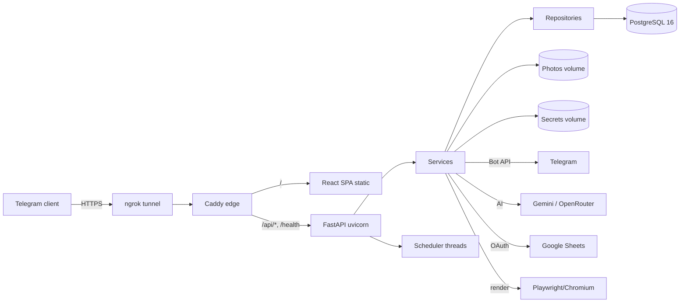
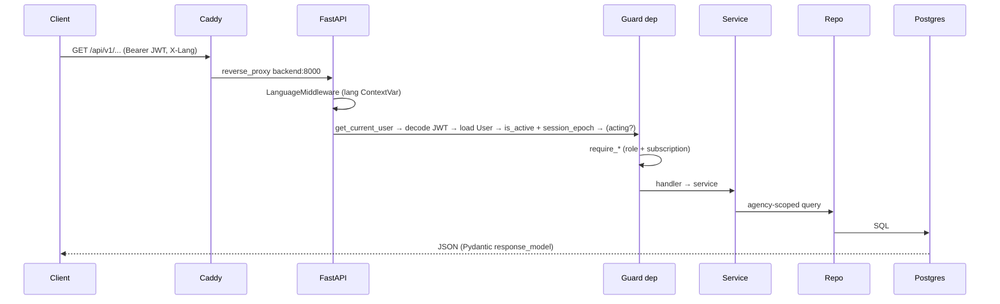
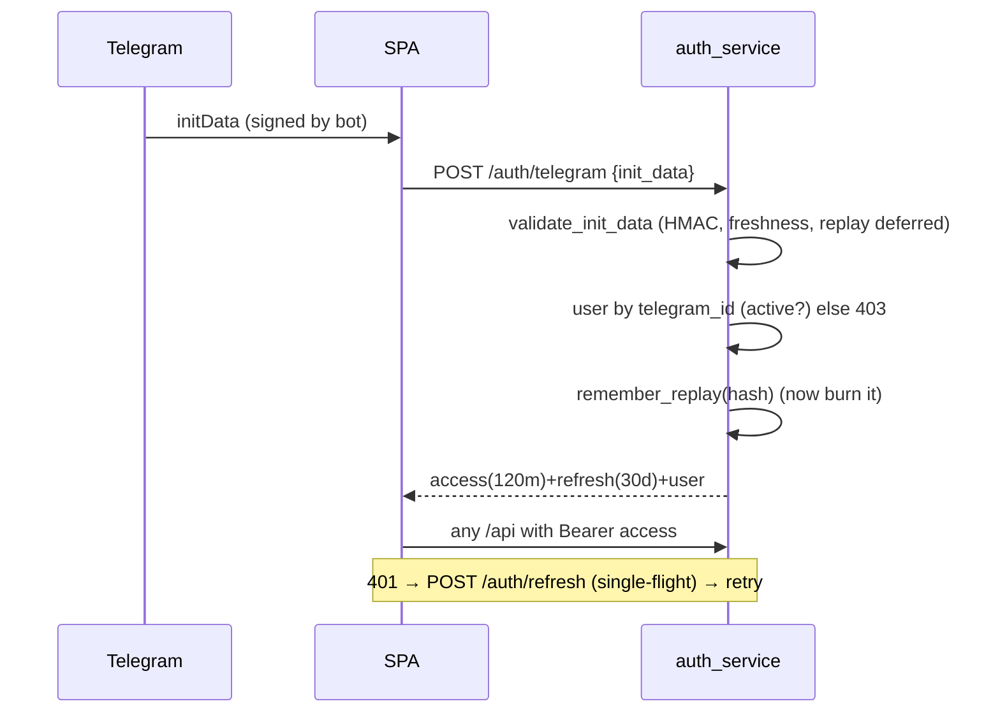
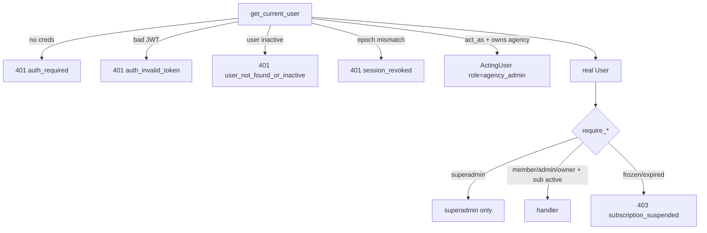
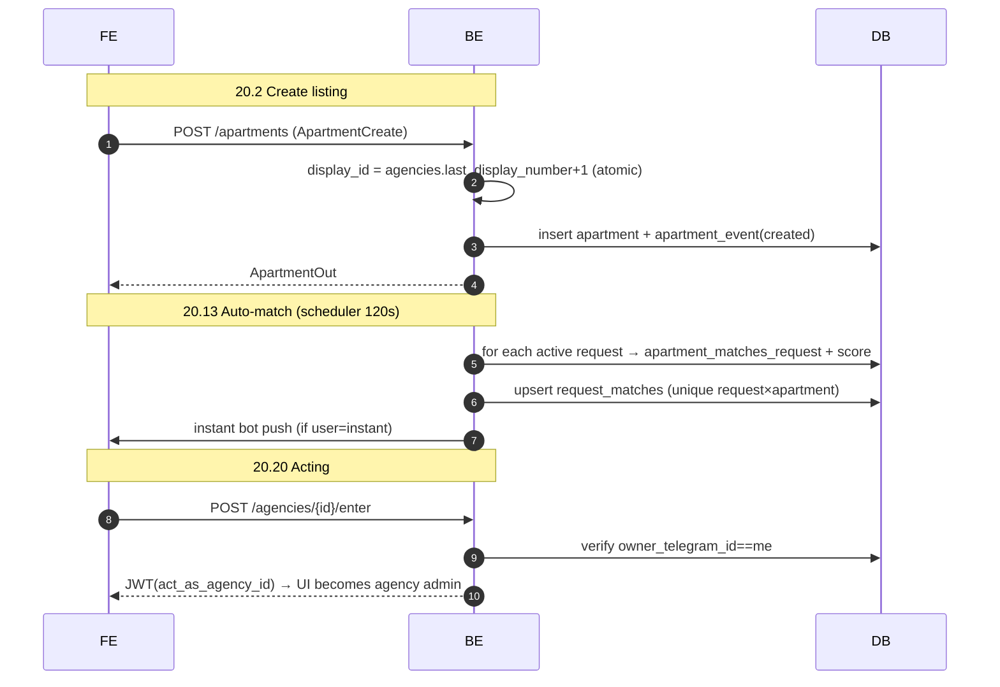
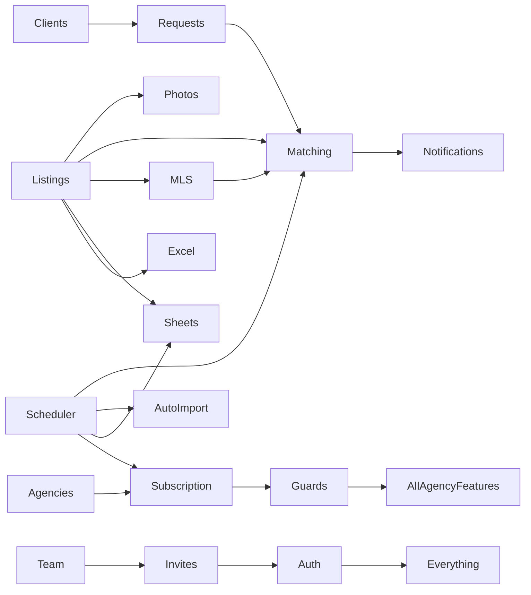

# Realty‑AI — Official Technical Documentation (Single Source of Truth)

> **Audience:** a senior engineer who has never seen this codebase and must be able to run, maintain, extend, and own it without asking questions.
> **Nature:** teaching manual, not an audit. Where a fact is not directly verifiable from source it is labelled **Inference**.
> **Companion file:** `ARCHITECTURE_AUDIT.md` (evaluation/scores). This document is the *reference manual*; cross‑references use `→ PART n`.

## Table of Contents
1. Executive Overview · 2. System Overview · 3. User Roles · 4. Feature Encyclopedia · 5. UI · 6. API · 7. Database · 8. Business Logic · 9. Services · 10. Repositories · 11. Background Processes · 12. Authentication · 13. Authorization · 14. External Integrations · 15. File Storage · 16. Notifications · 17. Configuration · 18. Project Structure · 19. Dependencies · 20. Workflows · 21. Dependency Map · 22. Edge Cases · 23. Developer Handbook

---

# PART 1 — Executive Overview

**What it is.** Realty‑AI is a **multi‑tenant SaaS for real‑estate agencies**, delivered as a **Telegram Mini App** (a web app that runs inside Telegram). One platform, many isolated "agencies"; each agency runs its listings, team, client CRM, deals, and optional cross‑agency sharing.

**Why it exists.** Uzbek agencies previously worked in a single Telegram bot with hard‑coded lists and no per‑agency isolation, no CRM, no analytics, and manual data entry. Realty‑AI turns that into a proper product: isolated tenants, AI‑assisted data entry, client matching, and monetization by subscription.

**Business model.** The **platform owner (superadmin)** rents "agencies" to customers and manages their **subscriptions manually** (extend N days / set a date, optionally recording an amount). Agencies get full access while their subscription is active; frozen/expired agencies are blocked (data preserved). Superadmins may also run their own **personal agencies** (free, no subscription).

**Target users.**
- **Superadmin** — platform owner (1..N people). Manages agencies, subscriptions, monitoring, MLS oversight, personal agencies.
- **Agency admin (main / regular)** — runs an agency: listings, team, clients, settings, imports.
- **Agent** — day‑to‑day employee: adds/searches listings, manages *their own* clients and deals.

**Main use cases / typical day (agent).** Open the Mini App from Telegram → land on Home dashboard → add a listing (manually, by AI link import, or reviewed from a watched channel) → search the base → save a client request → get auto‑matched listings → log calls/showings, create tasks and deals → share a listing to a client via the bot.

**System capabilities.** Listings CRUD (+archive/restore/permanent), photos, duplicate manager, AI import (link + bulk Telegram channel + Excel/CSV), client CRM (requests, activities, tasks, deals), auto‑matching, cross‑agency **MLS**, Google Sheets 2‑way sync, Excel export, team/invites, agency management + monitoring, subscription lifecycle, in‑app & bot notifications.

**Limitations (by design, today).** Single backend instance (background jobs and some security state live in‑process → not horizontally scalable); runs on one office PC in WSL2 Docker behind an **ngrok** tunnel; Telegram‑only authentication; no CI/CD or staging; local backups only. → *see* `ARCHITECTURE_AUDIT.md` for scoring.

---

# PART 2 — Complete System Overview

## 2.1 High‑level architecture (modular monolith, layered)

## 2.2 Components / modules
| Component | Tech | Role |
|---|---|---|
| SPA | React 18 + Vite + Tailwind | Mini App UI |
| Edge | Caddy | TLS (via tunnel), CSP/headers, `/api` proxy, SPA static |
| API | FastAPI + uvicorn | HTTP API `/api/v1/*`, `/health`, `/` |
| Services | Python | business logic (`app/services`) |
| Repositories | Python + SQLAlchemy 2.0 | data access (`app/repositories`) |
| DB | PostgreSQL 16 | persistence |
| Scheduler | Python threads | matching, auto‑import, sheets sync, subscriptions |
| Backup | postgres:16 sidecar | pg_dump + photos copy |
| Tunnel | ngrok | fixed public HTTPS domain |

## 2.3 Startup process (`app/main.py` `lifespan`)
1. `run_migrations()` — Alembic `upgrade head` (`app/db/migrate.py`).
2. `bootstrap_superadmin()` → `ensure_superadmins()` — force configured Telegram IDs to active `superadmin` (agency_id NULL), demote others.
3. `os.makedirs(settings.photos_dir)`.
4. `start_scheduler()` — 4 daemon threads (→ PART 11).
Middleware assembled: `install_db_retry` (outermost) · body‑size limit · `LanguageMiddleware`. Exception handlers: `RequestValidationError`→422 localized; `Exception`→500 `internal_error` + alert.

## 2.4 Shutdown process
FastAPI lifespan yields; on process stop, daemon threads die with the process (no graceful drain). Docker `restart: unless-stopped` relaunches. **Inference:** no explicit cleanup hooks; safe because all state is in Postgres/volumes.

## 2.5 Core flows (diagrams)
**Request flow**

**Auth / Authorization / Scheduler / Notification flows** → PART 12, PART 13, PART 11, PART 16.

---

# PART 3 — User Roles

Roles are stored on `users.role` with a DB CheckConstraint `('superadmin','agency_admin','agent')` (→ PART 7). `is_owner` distinguishes the **main admin**. There is a synthetic **ActingUser** (a superadmin operating inside a personal agency).

## 3.1 Role reference
| Attribute | superadmin | agency_admin (owner) | agency_admin | agent |
|---|---|---|---|---|
| Purpose | platform owner | run agency + manage team | run agency | daily work |
| `agency_id` | NULL | set | set | set |
| Visible tabs | Agencies, Мои (personal), Общая база (MLS), Settings, Profile | Home, Search, Add, Database, Clients, Team, Analytics, Settings, Profile | same minus team‑mgmt actions | Home, Search, Add, Database (own scope), Clients (own), Profile |
| Data scope | none (no agency)¹ | all agency data | all agency data | **own** clients/deals |
| Team mgmt | ✗ | invite/remove/roles/transfer | ✗ | ✗ |
| Agencies mgmt | ✓ | ✗ | ✗ | ✗ |
| Subscription bypass | n/a | if personal agency | if personal agency | if personal agency |

¹ To touch listings a superadmin must **enter a personal agency** (→ PART 20.20, acting).

## 3.2 Permission inheritance
No DB inheritance; enforced procedurally by guards (`require_superadmin`, `require_agency_member/admin/owner`) that check `role`, `agency_id`, `is_owner`, and subscription. Hierarchy: superadmin ⟶ (acting) admin(owner) ⟶ admin ⟶ agent.

## 3.3 Permission matrix (● / ○ / ◐ own‑only) → identical to `ARCHITECTURE_AUDIT.md` §3.3; reproduced there.

## 3.4 Edge cases
- Agent scope = `created_by == user.id` (`client_service._owner_filter`, `_load_client_for_user`). Admin = all (`_can_see_all`).
- Disabling/removing a member bumps `session_epoch` → all their JWTs die instantly (→ PART 12).
- ActingUser is **read‑only** and must never be `db.add`/`commit`‑ed (→ PART 23).

---

# PART 4 — Feature Encyclopedia

Each feature below lists: purpose · who · frontend · backend · models · endpoints · logic · errors · limits. Cross‑references point to detailed API (PART 6), DB (PART 7), workflows (PART 20).

### 4.1 Telegram Login & Session
Purpose: identify the Telegram user and mint a session. Who: everyone. Frontend: `App.tsx` phase machine + `api.ts` silent refresh. Backend: `auth_service`, `core/security`. Models: `users`. Endpoints: `POST /auth/telegram`, `POST /auth/refresh`, `GET /auth/me`. Logic: validate `initData` HMAC + freshness + anti‑replay → load active user → issue access(120m)+refresh(30d). Errors: `telegram_login_not_configured`, `init_data_*`, `not_in_agency`, `access_deactivated`. → PART 12, PART 20.1.

### 4.2 Listings (Apartments) CRUD + lifecycle
Purpose: the product core — manage properties. Who: agency members. Frontend: `screens/Apartments.tsx` (Add/Edit/Detail/List/Database/Archive/Duplicates/Search). Backend: `apartment_service`, `apartment_repo`. Models: `apartments`, `apartment_photos`, `apartment_events`. Endpoints: `/apartments` (+ `stats`, `archived`, `similar`, `analytics`, `timeseries`, `duplicates`, `import`) and `/{id}` (`get/patch/status/delete/restore/permanent/share/share-prepare/events`). Logic: per‑agency `display_id` counter; status×deal_type invariant; soft delete `deleted_at`; every mutation logs an `apartment_event`. Errors: `apartment_not_found`, `invalid_apartment_status`, `empty_apartment`, `invalid_currency`, `range_min_gt_max`, `value_negative`. → PART 20.2–20.6.

### 4.3 Photos
Purpose: attach/serve listing photos. Who: members (serve = public). Frontend: gallery in Apartments. Backend: `photo_service`. Models: `apartment_photos` + files on volume. Endpoints: `GET/POST/DELETE /apartments/{id}/photos*`, `GET /photos/{key}` (public). Logic: file on disk keyed by unguessable `storage_key`; SSRF‑guarded URL import; orphan sweep (→ PART 11). → PART 15.

### 4.4 Duplicate manager
Purpose: find likely duplicate listings (by normalized owner phone). Frontend: Duplicates screen. Backend: `duplicate_service`. Models: `apartments`, `duplicate_dismissals`. Endpoints: `GET /apartments/duplicates`, `POST /apartments/duplicates/dismiss`. Logic: group by `group_key` (last 9 phone digits), dismiss to hide a confirmed non‑duplicate group.

### 4.5 Client base (CRM)
Purpose: manage buyers/renters. Who: members (agent = own). Frontend: `screens/Clients.tsx`. Backend: `client_service`, `client_repo`. Models: `clients`, `client_requests`, `request_matches`, `client_activities`, `tasks`, `deals`. Endpoints: `/clients*` (→ PART 6.5). Logic: soft‑archive clients (restorable), agent own‑scope, priority "traffic‑light", mute notifications. → PART 20.11–20.17.

### 4.6 Requests & Auto‑matching
Purpose: saved searches auto‑matched to inventory. Frontend: request cards + Matches screen. Backend: `client_service` (`apartment_matches_request`, `score_match`, `run_matching_tick`, `scan_request_against_base`). Models: `client_requests`, `request_matches`. Endpoints: `/clients/{id}/requests`, `/clients/matches*`, `/clients/requests/{id}` (patch/delete/rescan). Logic: lenient‑on‑missing matching, 0–100 score + reasons; unique `(request_id, apartment_id)` prevents dup matches; archived clients excluded; scheduler tick 120 s. → PART 20.13.

### 4.7 Activities / Tasks / Deals (+delete/restore)
Purpose: CRM timeline, to‑dos, pipeline & commission. Frontend: Client detail sub‑sections. Backend: `client_service`. Models: `client_activities`, `tasks`, `deals`. Endpoints: `/clients/{id}/activities|tasks|deals` + top‑level `/clients/tasks/{id}`, `/clients/deals/{id}`, `/clients/{id}/activities/{aid}` (all with delete). Logic: auto‑tasks for silent clients; deal stages with revenue from `deposit`; `agent_id` must be same‑agency active member. → PART 20.16.

### 4.8 MLS (cross‑agency sharing)
Purpose: share listings platform‑wide with hidden owner contact; owner oversight of the pool. Frontend: `shared_mls` toggle (Apartments), owner "Общая база" screen (Superadmin). Backend: `apartment_repo.search_shared`, `mls_service`, `client_service.list_matches`. Models: `apartments.shared_mls`, `request_matches.source`. Endpoints: `GET /mls/pool` (superadmin). Logic: for `source='mls'` matches and the pool, blank `owner_phone/address/comment/source*/created_by/created_by_name`; keep district/price + agency brand. → PART 20.14.

### 4.9 AI listing import (by link)
Purpose: paste a listing URL → AI fills the form. Backend: `listing_import_service`, `core/browser_render`. External: Gemini→OpenRouter, Playwright. Endpoint: `POST /apartments/import`. Logic: SSRF‑guarded fetch (httpx → Playwright fallback), AI extraction, warnings; nothing saved until user confirms. Errors: `import_ai_not_configured`, `import_fetch_failed`, `import_no_data`, `import_ai_failed`, `import_ai_rate_limited`, `import_only_telegram`, `no_photos_in_post`. → PART 14, PART 20.8.

### 4.10 Bulk / background Telegram channel import
Purpose: pull a public channel's listings; auto‑import new posts. Who: agency owner. Frontend: `screens/Settings.tsx` (import card + watches). Backend: `telegram_channel_service`. Models: `apartments`, `watched_channels`. Endpoints: `POST /imports/telegram/scan`, `/imports/telegram/watches` (list/add/delete). Logic: read `t.me/s/<channel>` feed, page by `before`, AI parse ≤3/page, dedup by `source_link`; reply "продано" archives parent; auto‑import loop 600 s. → PART 20.9.

### 4.11 Base import (Excel/CSV + AI column mapping)
Purpose: migrate an existing client base file. Who: owner. Frontend: Settings. Backend: `base_import_service`. Endpoints: `POST /imports/base/analyze`, `POST /imports/base/commit`. Logic: analyze returns columns+samples+AI mapping; commit re‑sends the file with confirmed mapping (file never stored). Errors: `import_file_empty/too_big/unreadable`, `import_xlsx_unsupported`, `import_no_mapping`.

### 4.12 Google Sheets 2‑way sync
Purpose: mirror listings to a Google Sheet, both directions. Who: owner. Frontend: Settings. Backend: `sheets_service`. Models: `agency_sheets` (encrypted refresh token). Endpoints: `/sheets/*`. Logic: OAuth `drive.file`; snapshot + last‑write‑wins; 45 s loop. Errors: `sheets_not_configured/connected`, `sheets_oauth_failed`, `sheets_api_error`. → PART 14.

### 4.13 Excel export
Purpose: download listings as `.xlsx`. Endpoint: `POST /exports/excel` → signed link → `GET /exports/excel/file`. Errors: `excel_unsupported`, `export_link_invalid`.

### 4.14 Team & Invites
Purpose: add/manage employees. Who: owner (mgmt), members (view). Frontend: `screens/Team.tsx`, `Invites.tsx`. Backend: `member_service`, `invite_service`. Models: `users`, `invites`, `audit_log`. Endpoints: `/team/*`, `/invites/*`. Logic: invite code/link; redeem binds Telegram user; disable/remove bumps `session_epoch`; owner‑only role changes/transfer. → PART 20.18–20.19.

### 4.15 Agencies management & monitoring
Purpose: platform owner runs tenants. Frontend: `screens/Superadmin.tsx`. Backend: `agency_service`, `agency_usage_service`. Models: `agencies`, `subscription_payments`, `audit_log`. Endpoints: `/agencies/*`. Logic: create direct / by draft+activation link; subscription extend/set/freeze/activate; usage "traffic‑light"; per‑agency activity. → PART 20.20.

### 4.16 Personal agencies + acting
Purpose: superadmin owns free agencies and operates them as admin. Endpoints: `GET/POST /agencies/mine`, `POST /agencies/{id}/enter`. Logic: `agencies.owner_telegram_id` marks ownership; `enter` mints a JWT with `act_as_agency_id`; every request re‑verifies ownership. → PART 12, PART 13.

### 4.17 Subscription lifecycle
Purpose: keep tenants paid/blocked correctly. Backend: `scheduler` (warn + auto‑expire), `agency_service`. Endpoint: `POST /agencies/{id}/subscription`. Logic: warn owner `subscription_warn_days` before expiry; auto‑set status `expired`; blocked at guard (`_ensure_subscription_active`); personal agencies bypass. → PART 11, PART 16.

### 4.18 Dashboards & analytics
Purpose: at‑a‑glance metrics. Frontend: Home stats, Analytics, Superadmin analytics. Endpoints: `/clients/stats`, `/apartments/analytics|timeseries|agent/{id}/activity`. **Inference:** charts are CSS bars (no chart lib).

---

# PART 5 — Complete UI Documentation

**Framework:** React 18, custom stack navigator (`nav.tsx`), lazy‑loaded screens under `<Suspense>` (→ PART 9). Every screen is reached through `RouteView` (`App.tsx`). Global chrome: header (title/brand + Telegram BackButton) and `BottomTabs` (role‑dependent). Toasts appear bottom‑center (`role=status aria-live=polite`).

> **Coverage note (Inference where marked):** the following documents each screen's purpose, access, navigation, and primary actions/requests. Button‑level detail is verified for screens read in full (Clients, Superadmin/PaymentHistory/MLS, Settings import card, Apartments filter/photos); other button texts come from i18n keys and may be labelled **Inference**.

### 5.1 Phase screens (pre‑app, `App.tsx`)
- **Loading** — spinner while `initData` login/refresh resolves.
- **OpenInTelegram** — shown when not launched inside Telegram; also probes `/health`.
- **Join** — invite redemption path (auto after 403 `not_in_agency`).
- **Suspended (`Profile.SuspendedScreen`)** — agency frozen/expired; explains blocked access.

### 5.2 BottomTabs (navigation)
- **Superadmin:** Agencies · Мои (personal) · Общая база (MLS) · Settings · Profile.
- **Member:** Home · Search · [+ Add floating] · Database · Profile. (Clients/Analytics/Team reached from Home/menus.)

### 5.3 Home (`screens/Home.tsx`)
Purpose: dashboard. Access: members. Contains: greeting/brand hero, **ClientStatsBlock** (`/clients/stats`), listing stats (`/apartments/stats`), onboarding card when base empty (→ addObject). Empty/loading/error states handled. **Inference** on exact widget list.

### 5.4 Search + ObjectList (`Apartments.tsx`)
Purpose: filter inventory. Filters: deal type, district(s), type(s), rooms, floor, area, price, currency, text. Filter chip toggles `showFilter`; selected filter chip is indigo. Result rows open Object Detail. From search you can **Save as request** (→ SaveRequest). Requests to `GET /apartments?...`.

### 5.5 Add / Edit Object (`Apartments.tsx`)
Purpose: create/update a listing. Inputs: all `_ApartmentBase` fields (deal_type, rent_period, name, owner_phone, district, address, type, rooms, floor, total_floors, area, land_area, condition, furniture_appliances, price, currency, description, comment, photo_url, source_link, source, **shared_mls**). AI‑import card (paste link → prefill). Photo upload/import/reorder/delete. Save → `POST/PATCH /apartments`. Validation errors localized inline via toast.

### 5.6 Object Detail (`Apartments.tsx`)
Shows full card, photo gallery (first photo cover 2×2), status actions (active/deposit/sold or rented), edit, archive (`delObjQ`), share to client (`/share`, `/share-prepare`), event log (`/events`). Archived detail offers restore.

### 5.7 Database / Archive / Duplicates
- **Database** — the agency's listings list.
- **Archive** — `deleted_at` items with restore + delete‑forever (`delObjQ`/`deleteForeverQ`).
- **Duplicates** — grouped likely‑dupes with dismiss.

### 5.8 Clients (`screens/Clients.tsx`)
Purpose: CRM list. Top: **Matches banner** (`/clients/matches/summary` count; opens Matches). **Active/Archive toggle** (archived → `?archived=true`, each row has **Вернуть из архива**). Search (debounced). Add client form. Rows → Client Detail.

### 5.9 Client Detail (`Clients.tsx`)
Sections: header (name/priority/mute/edit/delete), **Requests** (add/edit/delete/rescan; each shows match counts), **Matches** subset, **History** (`ClientHistory`: quick‑log call/message/show/meeting + note; each entry has a **trash** delete), **Tasks** (`ClientTasks`: add, toggle done, **trash** delete), **Deals** (`ClientDeals`: create with price/commission/currency, change stage, **trash** delete), **Hints** (`/hints`). Delete client = soft archive (`delClientQ`).

### 5.10 Matches (`Clients.MatchesScreen`)
**Active/Dismissed tabs.** Active: each match shows client, score %, reasons (✓ good / ⚠ missing), MLS badge (hidden contact), apartment card, and actions **В сделку / Предложено / Отклонить**. Dismissed tab: **Вернуть** (restore → status `new`). Opening the active list marks new matches seen.

### 5.11 Settings (`screens/Settings.tsx`)
Language + theme (Sun/Moon), notify preference, **Telegram bulk import card** (channel input, `share_mls` checkbox, Start/Stop with interruptible loop, progress: scanned/created/failed/archived), **watches** list (add/remove), **Google Sheets** connect/status/push/pull/disconnect, **Excel export**, support link. Footer.

### 5.12 Superadmin screens (`screens/Superadmin.tsx`)
- **AgenciesScreen** — create agency, **UsageSummary** (traffic‑light), **RevenuePanel** (`/agencies/payments/summary`), agency rows → Manage.
- **AgencyManageScreen** — details, subscription actions (extend/set date/freeze/activate via prompts), rename, change admin, change phone, delete (double confirm), **AgencyActivityPanel** (`/{id}/activity`), **PaymentHistory** (`/{id}/payments`, each row **trash** delete → `delPaymentQ`), activation card (QR + code) for pending drafts.
- **AgencyCreateScreen** — name/days/phone → draft + activation link (QR).
- **MyAgenciesScreen** — personal agencies list, create (prompt), **Войти** (enter/acting).
- **MlsPoolScreen** — all shared objects platform‑wide: deal‑type pills, agency filter `<select>`, text search, "Всего", cards (agency badge, district/type/rooms/price/status/date), "Показать ещё". Contacts hidden.

### 5.13 Profile / Team / Invites / Analytics / AgentDetail
- **Profile** — user identity, role label, language/theme link, "logout everywhere" (session_epoch), acting banner + "exit to platform".
- **Team** — members list, audit, patch (enable/disable/role), remove, revoke sessions, transfer owner.
- **Invites** — create invite (role/days), list, revoke, share link/QR.
- **Analytics** — month cards, conversion, agent leaderboard.
- **AgentDetail** — one employee's activity (`/apartments/agent/{id}/activity`).

---

# PART 6 — API Documentation

Base prefix `/api/v1`. Auth = `Authorization: Bearer <access JWT>` unless noted. Header `X-Lang: ru|uz|en` selects error language. Errors: `AppError` → `{"detail": "<localized>"}`; 422 → `{"detail":[{loc,msg,type}]}`; 500 → `{"detail":"<internal_error localized>"}`.

> Below, each router lists **every** endpoint with method · path · auth · authz · purpose · key input · output · main errors · side effects. Full prose is given for the auth, acting, and import endpoints; the rest are documented as complete per‑endpoint rows.

### 6.1 `auth` (`/auth`)
**`POST /auth/telegram`** — *Login.* Auth: none. Body: `{ init_data: string }`. Logic: `security.validate_init_data` (HMAC over sorted fields with secret `HMAC("WebAppData", bot_token)`, both signature‑in/out check strings accepted; `auth_date` freshness ≤ `init_data_max_age_seconds`; **anti‑replay deferred** until session actually issued) → find active `users` row by `telegram_id` → update username/full_name/last_login → `audit_log` login → `build_auth_response`. Output: `{access_token, refresh_token, token_type:"bearer", subscription_active, user}`. Errors: `telegram_login_not_configured`(503), `init_data_*`(401), `not_in_agency`(403), `access_deactivated`(403), `init_data_replayed`(401). Side effects: user update + audit row.
**`POST /auth/refresh`** — *Silent renew.* Auth: refresh token in body `{refresh_token, act_as_agency_id?}`. Logic: `decode_refresh_token` (must be `type=refresh`) → load active user → check `session_epoch` → `build_auth_response(act_as_agency_id)`. Errors: `auth_invalid_token`, `user_not_found_or_inactive`, `session_revoked`. Used by `api.ts` on 401 (single‑flight).
**`GET /auth/me`** — current `UserProfile`. Auth: any logged‑in user.

### 6.2 `agencies` (`/agencies`, `require_superadmin`)
| Method · Path | Purpose | Input | Output | Notes / errors |
|---|---|---|---|---|
| POST `""` | create agency (direct, with admin) | AgencyCreate | AgencyOut | `agency_name_empty`, `cannot_assign_superadmin_as_admin` |
| POST `/draft` | create pending draft + activation link | AgencyDraftCreate | AgencyDraftOut | activation QR/code |
| GET `""` | list agencies | — | AgencyOut[] | — |
| GET `/usage` | engagement/usage per agency | — | AgencyUsageOut[] | excludes deleted objects |
| GET `/mine` | my personal agencies | — | AgencyOut[] | owner_telegram_id == me |
| POST `/mine` | create personal agency | PersonalAgencyCreate | AgencyOut | `personal_agency_name_required` |
| POST `/{id}/enter` | **enter (acting)** | — | AuthResponse | must own; mints `act_as_agency_id` JWT |
| PATCH `/{id}` | rename / phone | AgencyUpdate | AgencyOut | writes audit |
| DELETE `/{id}` | delete agency (irreversible) | — | 204 | cascades users (FK) |
| POST `/{id}/admin` | set/replace admin | AgencyAdminUpdate | AgencyOut | `cannot_assign_superadmin_as_admin` |
| POST `/{id}/subscription` | extend/set/freeze/activate | AgencySubscriptionUpdate | AgencyOut | appends `subscription_payments`; `subscription_*_required`, `unknown_action` |
| GET `/payments/summary` | revenue totals | — | PaymentsSummaryOut | — |
| GET `/{id}/payments` | payment history | — | AgencyPaymentOut[] | — |
| DELETE `/{id}/payments/{pid}` | delete a payment row | — | 204 | `payment_not_found`; doesn't change sub date |
| GET `/{id}/audit` | agency audit log | — | AgencyAuditOut[] | — |
| GET `/{id}/activity` | detailed activity | — | AgencyActivityOut | safe tz helper |
| GET `/{id}/activation` | current activation link | — | ActivationOut? | excludes used |
| POST `/{id}/activation` | reissue link | — | ActivationOut | — |
| DELETE `/{id}/activation` | revoke link | — | 204 | — |

### 6.3 `apartments` (`/apartments`, `require_agency_member`)
| Method · Path | Purpose | Notes |
|---|---|---|
| POST `""` (201) | create listing | body ApartmentCreate; per‑agency display_id; logs `created` |
| GET `""` | search/list (paged) | ApartmentListOut; filters (→ 5.4) |
| GET `/archived` | trash list | ApartmentListOut |
| GET `/stats` | status counts | ApartmentStatsOut |
| GET `/duplicates` | dup groups | DuplicateGroupOut[] |
| POST `/duplicates/dismiss` (204) | hide a group | body key |
| GET `/analytics` | admin analytics | ApartmentAnalyticsOut |
| GET `/timeseries?period=` | added/sold buckets | TimeseriesOut |
| GET `/agent/{user_id}/activity` | agent events | AgentEventOut[] |
| GET `/similar` | similar objects | ApartmentOut[] |
| POST `/import` | AI import from link | ListingImportOut (nothing saved) |
| GET `/{id}` | get one | ApartmentOut; `apartment_not_found` |
| GET `/{id}/share` | share card (blanked) | ApartmentShareOut (owner phone→agency phone) |
| POST `/{id}/share` | send via bot | ShareResultOut; `share_*` errors |
| POST `/{id}/share-prepare` | Telegram shareMessage id | SharePrepareOut |
| GET `/{id}/events` | event log | ApartmentEventOut[] |
| PATCH `/{id}` | edit (whitelist) | ApartmentOut; logs `updated` |
| POST `/{id}/status` | change status | validates status×deal_type |
| DELETE `/{id}` (204) | soft delete | sets `deleted_at` |
| POST `/{id}/restore` | restore | clears `deleted_at` |
| DELETE `/{id}/permanent` (204) | hard delete + purge photos | owner‑gated **Inference** |

### 6.4 `clients` (`/clients`, `require_agency_member`)
Literal paths declared **before** `/{id}` (route‑ordering). Selected rows:
| Method · Path | Purpose |
|---|---|
| GET `""?q=&archived=` | list (agent=own; archived view) |
| POST `""` (201) | create client (+optional first request) → `{client, found}` |
| GET `/matches?status=` | matches (default new/seen/offered; `dismissed` for restore tab) |
| GET `/matches/summary` | new‑count badge |
| POST `/matches/seen` | mark all seen |
| POST `/matches/{id}/status` (204) | set new/seen/offered/dismissed |
| GET `/stats` | dashboard client/deal stats |
| PATCH `/notify` | set off/instant/daily (`invalid_notify_pref`) |
| PATCH/DELETE `/requests/{id}`, POST `/requests/{id}/rescan` | edit/delete/rescan request |
| GET `/tasks`, PATCH/DELETE `/tasks/{id}` | my tasks; toggle/delete |
| GET `/deals`, PATCH/DELETE `/deals/{id}` | my deals; edit/delete |
| GET/PATCH/DELETE `/{id}` | client detail/edit(status incl. restore)/soft‑archive |
| POST `/{id}/requests` (201) | add request → `{request, found}` |
| GET/POST `/{id}/activities`, DELETE `/{id}/activities/{aid}` | timeline + delete |
| GET/POST `/{id}/tasks` | client tasks |
| GET/POST `/{id}/deals` | client deals |
| GET `/{id}/hints` | rule‑based hints |
Errors: `client_not_found`, `request_not_found/empty`, `match_not_found`, `invalid_*_status`, `task/deal/activity_not_found`, `invalid_owner/agent`.

### 6.5 Other routers (complete)
- **`dictionaries` (`/dictionaries`)**: GET (list, member) · POST/PATCH/DELETE (admin write; `dict_value_exists/not_found`).
- **`exports` (`/exports`)**: POST `/excel` (build + signed link) · GET `/excel/file` (download, signed, hidden from schema).
- **`imports` (`/imports`, owner)**: POST `/base/analyze`, POST `/base/commit`, POST `/telegram/scan`, GET/POST/DELETE `/telegram/watches`.
- **`mls` (`/mls`, superadmin)**: GET `/pool` (all shared objects, contacts hidden; rate‑limited).
- **`invites` (`/invites`)**: POST (create, owner) · GET (list) · DELETE `/{id}` (revoke) · POST `/redeem` (public‑ish: uses initData to bind).
- **`settings` (`/agency`)**: GET/PATCH `/settings` (agency settings; admin).
- **`photos`**: GET `/apartments/{id}/photos` · POST upload/import/reorder · DELETE `/apartments/{id}/photos/{pid}` · **GET `/photos/{key}` (public, no auth)**.
- **`sheets` (`/sheets`)**: POST `/connect` · GET `/oauth/callback` (hidden) · GET `/status` · POST push/pull/… · POST `/disconnect`.
- **`team` (`/team`, owner)**: GET (members) · GET `/audit` · PATCH `/{id}` (enable/disable/role) · DELETE `/{id}` · POST `/{id}/revoke` · POST `/{id}/owner` (transfer).

---

# PART 7 — Database Documentation

PostgreSQL 16. All BIGINT PKs (autoincrement). Nearly every table carries `agency_id BIGINT FK→agencies ON DELETE CASCADE` (tenant isolation). Timestamps are `timezone=True`. 30 Alembic migrations (`0001`→`0030`), applied at boot.

### 7.1 `agencies`
Purpose: tenant. Constraints: `status IN (trial,active,frozen,expired,pending)`.
| Field | Type | Req | Default | Meaning |
|---|---|---|---|---|
| id | BIGINT PK | ✓ | auto | tenant id |
| name | String | ✓ | — | internal name (set by superadmin) |
| project_name | String | ✗ | NULL | public brand (set by admin) |
| status | String | ✓ | trial | subscription state |
| subscription_expires_at | tz ts | ✗ | NULL | access until |
| subscription_warned_at | tz ts | ✗ | NULL | last warn sent |
| activated_at | tz ts | ✗ | NULL | activation time |
| timezone | String | ✓ | Asia/Tashkent | agency tz |
| default_currency | String | ✓ | USD | default currency |
| contact_phone | String | ✗ | NULL | **public** agency phone (used in share) |
| client_phone | String | ✗ | NULL | opener's phone (superadmin‑only) |
| notify_new_objects | Bool | ✓ | false | notify admins on new listing |
| created_by | BIGINT | ✗ | NULL | superadmin telegram_id creator |
| owner_telegram_id | BIGINT idx | ✗ | NULL | **personal agency** owner |
| pending_days | Integer | ✗ | NULL | days to grant on activation |
| last_display_number | Integer | ✓ | 0 | per‑agency listing counter |
| created_at/updated_at | tz ts | ✓ | now() | audit |

### 7.2 `users`
Constraint `role IN (superadmin,agency_admin,agent)`; `telegram_id` unique idx; `agency_id` FK→agencies **CASCADE**.
Key fields: `telegram_id`(uniq), `username`, `full_name`, `agency_id`(NULL only for superadmin), `role`, `is_owner`(main admin), `is_active`, `match_notify`(off/instant/daily), **`session_epoch`**(revocation counter), `last_login_at`, timestamps.

### 7.3 `apartments`
Constraints: unique `(agency_id, display_id)`; `status IN (active,deposit,sold,rented)`; `deal_type IN (sale,rent)`; `rent_period NULL|month|day`; furniture enum; `length(currency) 1..8`. Indexes on agency×{status,district,type,deal,rooms,price,created,created_by,deleted}. FK `created_by`→users **SET NULL**.
| Field | Type | Notes |
|---|---|---|
| display_id | String | "0001", unique per agency |
| status/deal_type/rent_period | String | lifecycle (→ 8) |
| name/owner_phone/district/address/type/condition/description/comment/photo_url/source_link | Text | `owner_phone`+`comment`+`source` hidden on share/MLS |
| source | String | channel/site name (internal) |
| rooms/floor/total_floors | Integer | — |
| area | Numeric(8,2) | m² |
| land_area | Numeric(10,2) | sotka |
| price | **Numeric(18,2)** | widened for UZS |
| currency | String | default USD |
| shared_mls | Bool | MLS opt‑in |
| created_by | BIGINT FK users SET NULL | author |
| archived_at | tz ts | when sold |
| deleted_at | tz ts | **soft delete** |

### 7.4 `apartment_photos`
`storage_key`(uniq — also the public URL segment), `content_type`, `sort_order`, FK apartment/agency CASCADE. Files live on the photos volume (→ PART 15).

### 7.5 `apartment_events`
`user_id`(FK users SET NULL), `action`(created/updated/status), `note`(changed fields / new status). Per‑listing audit trail.

### 7.6 `clients`
`name`(req), `last_name`, `phone`(confidential), `note`, `priority`(hot/warm/cold), `source`(free text), `created_by`(agent owner idx), `status`(active/archived — **soft archive**), `muted`, timestamps.

### 7.7 `client_requests`
Saved search. `deal_type`(sale/rent), `types`/`districts`(JSON lists), `rooms/floor/land_area/area/price` min‑max, `currency`, `note`, `status`(active/fulfilled/cancelled), `created_by`. FK client/agency CASCADE.

### 7.8 `request_matches`
Unique `(request_id, apartment_id)` (dedup). `status`(new/seen/offered/dismissed), `score`(0–100), `reasons`(JSON `{good:[],missing:[]}`), `source`(own/mls). FKs request/apartment/agency CASCADE.

### 7.9 `client_activities`
`kind IN (call,show,meeting,message,note,price_change)`, `note`, `created_by`, idx (client, created_at).

### 7.10 `tasks`
`status IN (open,done)`, `kind IN (manual,auto)`, `title`, `deadline`(Date), `done_at`, idx (agency,status).

### 7.11 `deals`
`stage` (check: new→…→sold, cancelled), `price/commission` Numeric(18,2) + currencies, `agent_id`(responsible), `seller_agency_id`(cross‑agency seed), `apartment_id` FK **SET NULL**, `closed_at`. Revenue counts from stage `deposit` (`DEAL_REVENUE_STAGES`). idx (agency,stage).

### 7.12 `subscription_payments`
`action`(extend/set), `days`, `amount` Numeric(18,2), `currency`, `method`(free text), `note`, `expires_at_after`, `created_by_telegram_id`. Ledger; deletable (→ 4.15).

### 7.13 `dictionaries`
Per‑agency lookup lists. Unique `(agency_id, category, value)`. `category`(district/property_type/condition/furniture/source), `value`, `sort_order`, `is_active`.

### 7.14 `invites`
`code`(uniq idx), `role`(default agent), `created_by`(FK users SET NULL), `expires_at`, `used_at`, `used_by_telegram_id`.

### 7.15 `watched_channels`
Unique `(agency_id, channel)`. `channel`, `last_post_id`(cursor), `enabled`, `share_mls`, `created_by`, `last_checked_at`.

### 7.16 `agency_sheets`
PK = `agency_id` (one per agency). **`refresh_token` stored ENCRYPTED** (`EncryptedText`/Fernet, `app/db/types.py`, key `APP_ENCRYPTION_KEY`). `spreadsheet_id/url`, `sheet_title`, `status`(connected/disconnected/error), `error_note`, `snapshot`(JSON, merge base), `last_modified_time`, `last_sync_at`.

### 7.17 `audit_log`
Platform‑wide event log. `agency_id`(nullable, **no FK** — survives agency deletion), `actor_user_id`, `actor_telegram_id`, `actor_name`, `ip`, `action`(idx), `target`, `note`. Not user‑FK'd (survives user deletion).

### 7.18 `duplicate_dismissal`
Unique `(agency_id, group_key)`. `group_key` = normalized owner phone (last 9 digits).

### 7.19 Ownership, lifecycle, normalization notes
- **Tenant ownership** = `agency_id` everywhere; **user ownership** = `created_by`.
- **Soft delete**: apartments (`deleted_at`), clients (`status=archived`); everything else hard‑deletes. Audit logs & payments are intentionally FK‑less to survive deletions.
- **Inference:** no obvious denormalization problems; `actor_name`/`display_id` are deliberate denorm for display without joins.

---

# PART 8 — Business Logic (rules)

| Rule | Where | Enforcement | Why |
|---|---|---|---|
| Tenant isolation | repositories (`where agency_id==`), guards | procedural | data separation |
| Agent own‑scope | `_owner_filter`, `_load_client_for_user` | `created_by==user.id` | privacy between agents |
| Status × deal_type | `apartment_service._status_allowed_for_deal` | create + set_status | can't "sell" a rental |
| Lenient matching | `apartment_matches_request`, `score_match` | service | missing fields don't block; honest "missing" flags |
| Archived clients excluded | matching + lists | filters | no ghost matches/pushes |
| MLS blanking | `client_service.list_matches`, `mls_service` | field nulling | protect owner/agent identity |
| Subscription gate | `_ensure_subscription_active` | guards | monetization; personal bypass |
| Superadmin self‑heal | `ensure_superadmins` | boot | owner never locked out |
| Display‑ID monotonic | `agencies.last_display_number` | atomic increment | human‑readable IDs |
| Import dedup | `source_link` unique per agency | pre‑check | no duplicate imports |
| Deal/owner validity | `_valid_agent_id`, `invalid_owner` | service | no cross‑agency assignment |
| Error‑catalog completeness | `test_error_catalog` | test | no raw codes leak to users |
| Anti‑replay (initData) | `security._replay_check_and_remember` | in‑proc set | prevent replay of captured initData |
| Instant revocation | `session_epoch` in JWT | guard check | logout‑everywhere / kick |

**Hidden assumptions:** single backend instance (in‑proc replay/rate‑limit/scheduler); Telegram‑only auth; currencies USD/UZS/EUR.

---

# PART 9 — Services (`app/services`)

Each service is stateless (functions taking `db`, `agency_id`, `user`). Highlights:
- **`auth_service`** — `login_with_init_data`, `refresh_session`, `build_auth_response` (issues JWTs, resolves acting).
- **`apartment_service`** — create/search/update/status/delete/restore/analytics; `_status_allowed_for_deal`, `_attach_creators`, `_display_name`; logs events; purges photos.
- **`client_service`** — **large**: clients, requests, matching (`run_matching_tick`, `scan_request_against_base`, `apartment_matches_request`, `score_match`), activities, tasks, deals, hints, `run_autotask_tick`, `run_match_digest`, notify. → refactor candidate (PART 23).
- **`agency_service`** / **`agency_usage_service`** — agency CRUD, subscription actions (append payments + audit), usage/activity aggregation, `delete_payment`.
- **`member_service`** / **`invite_service`** — team & invites; `session_epoch` bump on disable/remove/revoke.
- **`photo_service`** — upload/import/serve/delete/sweep; `_assert_public_url` SSRF guard on all fetches.
- **`listing_import_service`** + **`core/browser_render`** — AI extraction (Gemini→OpenRouter) with Playwright fallback.
- **`telegram_channel_service`** — feed parse, `scan_page`, `auto_import_channel/all`.
- **`base_import_service`** — Excel/CSV analyze/commit.
- **`sheets_service`** — OAuth, 2‑way sync (`sync_all_connected`).
- **`telegram_service`** — bot send/prepare messages, `is_configured`.
- **`dictionary_service`** — dictionary CRUD.
- **`scheduler`** — background loops (→ PART 11).

Side effects, error handling, and call hierarchy per service follow the layered rule (services commit; repos flush). Errors are raised as `AppError(code)` (localized).

---

# PART 10 — Repositories (`app/repositories`)

Purpose: the **only** place that builds queries; always agency‑scoped. Examples:
- `apartment_repo` — `search` (filters + `lenient_missing`), `search_shared` (MLS pool cross‑agency), `list_mls_pool`, `list_archived`, `count_by_status`, `create`, `get_by_id`.
- `client_repo` — `list_clients(include_archived/only_archived)`, `get_client`, request/match/task/deal/activity CRUD + `get_activity/get_task/get_deal`, counts, `all_active_requests`, `has_similar_own`.
- `agency_repo` — `get_by_id`, list, usage helpers.
- `user_repo` — `get_by_id/get_by_ids/get_by_telegram_id/create`.
- `payment_repo` — `add/list_for_agency/totals_by_currency/count_all/get/delete`.
- `audit_repo`, `dictionary_repo`, `invite_repo`, `apartment_event_repo`.
Tenant isolation + ownership are applied here and re‑checked in services (`_load_*_for_user`). Sorting is usually `created_at desc`; pagination via `limit/offset`. Indexes → PART 7.

---

# PART 11 — Background Processes (`app/services/scheduler.py`)

`start_scheduler()` launches **4 daemon threads** (all wrapped in try/except; a failure logs and the loop continues — best‑effort, no external retry queue).

| Thread | Interval | Does |
|---|---|---|
| `_loop` | 6 h | `expire_due_subscriptions` → `run_subscription_warnings` (bot warn ≤N days, throttled 20 h) → **photo orphan sweep** (24 h) → `run_autotask_tick` ("client silent N days") → **daily match digest** (`run_match_digest`, 24 h, for users with `daily`) |
| `_sheets_loop` | 45 s | `sheets_service.sync_all_connected` (2‑way) |
| `_autoimport_loop` | 600 s | `telegram_channel_service.auto_import_all` (watched channels → new posts → AI → listings) |
| `_matching_loop` | 120 s | `client_service.run_matching_tick` (new listings → matches, instant push) |

Failure handling: each loop `try/except` + `db.close()` in `finally`; DB drops are additionally survived by `install_db_retry` on request paths. **No cron/Celery/Redis** — coupling to a single process (→ scale caveat).

---

# PART 12 — Authentication

- **initData validation** (`core/security.validate_init_data`): parse query string; recompute HMAC‑SHA256 over sorted `k=v` lines with `secret=HMAC("WebAppData", bot_token)`; accept signature‑included or excluded string; `hmac.compare_digest`; `auth_date` freshness; **anti‑replay** by remembered hash (in‑proc, TTL). Login uses `anti_replay=False` then burns the hash only on real session issue (so login→redeem with same initData isn't a false replay).
- **JWT** (HS256): secret from `JWT_SECRET` or auto‑generated & persisted to the **`/secrets` volume** (isolated from photos/backups). Access token `type=access` exp 120 min; refresh `type=refresh` exp 30 d. Claims: `user_id, telegram_id, agency_id, role, epoch` (+ `act_as_agency_id` when acting).
- **Session lifecycle & revocation:** `session_epoch` in both tokens; incrementing it (disable/remove member, "logout everywhere") invalidates all outstanding tokens immediately.
- **Token refresh:** `/auth/refresh` re‑checks user active + epoch; optional `act_as_agency_id` preserves acting across silent renew.

---

# PART 13 — Authorization

- **Guards** (`core/dependencies`): `require_superadmin`, `require_agency_member`, `require_agency_admin`, `require_agency_owner`. Member/admin/owner also run `_ensure_subscription_active` (personal agencies bypass).
- **Ownership rules:** agent = own rows; admin = all; superadmin = platform (no agency data). Acting re‑verifies `owner_telegram_id == user.telegram_id` **every request** — the JWT claim is never trusted alone.
- **Edge:** ActingUser is a dataclass, not ORM → must not be committed.

---

# PART 14 — External Integrations

| Integration | Purpose | Config | Auth | Data | Failure |
|---|---|---|---|---|---|
| **Telegram Bot API** | login verify, push, share | `BOT_TOKEN`, `BOT_USERNAME` | bot token HMAC | initData, messages, photos | coded error; features degrade |
| **Gemini** | AI field extraction | `GEMINI_API_KEY`, `IMPORT_AI_MODEL` (`gemini-2.5-flash-lite`) | API key | listing text → JSON fields | 429→`import_ai_rate_limited`; fallback OpenRouter |
| **OpenRouter** | fallback AI | `OPENROUTER_API_KEY`, `OPENROUTER_MODEL`, `IMPORT_AI_PROVIDERS` order | API key | same | graceful degrade / manual |
| **Google Sheets** | 2‑way sync | `GOOGLE_CLIENT_ID/SECRET`, tokens Fernet‑encrypted | OAuth `drive.file` refresh token | listing rows | coded errors; 45 s retry loop |
| **Playwright/Chromium** | render JS pages for import | `IMPORT_BROWSER_RENDER`, `IMPORT_BROWSER_TIMEOUT_MS` | — | HTML | silent fallback to httpx |
| **ngrok** | public HTTPS domain | `NGROK_AUTHTOKEN`, `NGROK_DOMAIN` | authtoken | tunnel | app unreachable |
All outbound URL fetches (photo import, browser render) pass `photo_service._assert_public_url` (SSRF guard; redirects disabled per‑hop).

---

# PART 15 — File Storage

- **Photos:** files on `photos_data` volume (`/data/photos`); metadata in `apartment_photos` (`storage_key`, `content_type`, `sort_order`). Served **publicly** at `GET /api/v1/photos/{key}` (needed so Telegram can fetch; keys are unguessable). Pillow (≥12.2) processes images; imports SSRF‑guarded and size/format‑limited.
- **Secrets:** `secrets_data` volume (`/secrets`) holds the auto‑generated JWT secret — deliberately **excluded from backups**.
- **Exports:** Excel built on demand, delivered via a **signed** short‑lived URL (`/exports/excel/file`); not persisted long‑term. **Inference:** temp file lifecycle short.
- **Cleanup:** scheduler orphan‑photo sweep (24 h) deletes files with no DB row.
- **Backups:** `backup` sidecar `pg_dump` every `BACKUP_INTERVAL_HOURS`, keep `BACKUP_KEEP`; photos copied read‑only. **Local only** (DR gap).

---

# PART 16 — Notifications

| Type | Channel | Trigger | Recipient |
|---|---|---|---|
| New match badge | in‑app | matching tick creates match | agent/admin (own scope) |
| Instant match push | bot | new match + user `instant` | agent |
| Daily match digest | bot | scheduler 24 h + user `daily` | agent |
| New listing notice | bot | listing created + `agencies.notify_new_objects` | agency admins |
| Subscription warning | bot | scheduler, ≤`SUBSCRIPTION_WARN_DAYS` before expiry | agency owner |
| Share to client | bot | agent shares a listing | the client (via bot) |
| 500 error alert | bot | unhandled exception | all superadmins (`ERROR_ALERTS_ENABLED`) |
| Toasts (ok/err/info) | in‑app | any action result | current user |
Bot delivery requires `BOT_TOKEN`; `telegram_service.is_configured()` gates it.

---

# PART 17 — Configuration (`app/config.py`, via `.env`)

| Var | Default | Required | Used by | Impact |
|---|---|---|---|---|
| `DATABASE_URL` | dev placeholder | prod ✓ | DB session | connection |
| `BOT_TOKEN` | — | for auth/bot | security, telegram_service | no token → login/bot disabled |
| `JWT_SECRET` | auto‑gen (secrets vol) | recommended | security | multi‑node needs a fixed value |
| `JWT_EXPIRE_MINUTES` | 120 | — | security | access lifetime |
| `REFRESH_EXPIRE_MINUTES` | 43200 (30d) | — | security | refresh lifetime |
| `TRUSTED_PROXY_COUNT` | 1 | — | ratelimit | correct client IP behind Caddy/tunnel |
| `SUPERADMIN_TELEGRAM_ID` | — | ✓(≥1 owner) | bootstrap | owner access |
| `SUPERADMIN_TELEGRAM_IDS` | — | optional | bootstrap | multiple owners (comma list) |
| `BOT_USERNAME` | — | optional | invites | pretty invite links |
| `SUPPORT_URL` | "" | optional | UI | support button |
| `INIT_DATA_MAX_AGE_SECONDS` | 3600 | — | security | initData freshness window |
| `SECRET_DIR` | /secrets | — | security | JWT secret store (off‑backup) |
| `ENABLE_DOCS` | false | — | main | /docs exposure (keep false in prod) |
| `PHOTOS_DIR` | /data/photos | — | photos | photo volume |
| `PHOTO_STORAGE_BACKEND` | local | — | photos | local vs s3 (**s3 not implemented — Inference**) |
| `APP_VERSION` | dev | — | /health | version tag |
| `PUBLIC_BASE_URL` | ngrok domain | ✓ (share) | share | absolute photo URLs |
| `SUBSCRIPTION_WARN_DAYS` | 3 | — | scheduler | warn window (0=off) |
| `ERROR_ALERTS_ENABLED` | true | — | monitoring | 500 alerts to owner |
| `GEMINI_API_KEY` | — | for AI import | listing_import | AI import |
| `IMPORT_AI_MODEL` / `_BULK` | gemini‑2.5‑flash‑lite | — | listing_import | model choice |
| `OPENROUTER_API_KEY` / `OPENROUTER_MODEL` | — / gpt‑oss‑120b:free | — | listing_import | fallback AI |
| `IMPORT_AI_PROVIDERS` | gemini | — | listing_import | provider order |
| `IMPORT_BROWSER_RENDER` / `_TIMEOUT_MS` | true / 40000 | — | browser_render | JS page rendering |
| `GOOGLE_CLIENT_ID/SECRET` | — | for Sheets | sheets | OAuth |
| `APP_ENCRYPTION_KEY` | — | for token encryption | crypto | Fernet key for Google tokens |
| Compose‑level | `POSTGRES_*`, `NGROK_AUTHTOKEN`, `NGROK_DOMAIN`, `BACKUP_INTERVAL_HOURS`, `BACKUP_KEEP` | ✓ (pw, authtoken) | compose | infra |

Empty‑string env values are coerced to `None` (validators). `superadmin_ids()` merges both superadmin vars.

---

# PART 18 — Project Structure

→ tree in `ARCHITECTURE_AUDIT.md` §2.1. Key files:
- `backend/app/main.py` — factory, lifespan, middleware, health, exception handlers.
- `backend/app/config.py` — all settings.
- `backend/app/api/router.py` — mounts 13 routers under `/api/v1`.
- `backend/app/core/*` — `security` (JWT/initData), `errors` (i18n catalog + AppError + LanguageMiddleware), `dependencies` (guards, ActingUser), `subscription`, `ratelimit`, `crypto`, `monitoring`, `browser_render`.
- `backend/app/db/*` — `base`, `session`, `migrate`, `retry`, `types` (EncryptedText), `models/` (19).
- `backend/alembic/versions/*` — migrations 0001–0030.
- `frontend/src/*` — `App.tsx` (routing/phases), `api.ts` (fetch+auth), `store.tsx` (context), `nav.tsx` (stack nav), `acting.tsx`, `telegram.ts`, `i18n.ts`, `components/ui.tsx`, `screens/*`.
- `docker-compose.yml`, `frontend/Caddyfile`, `backend/Dockerfile`, `frontend/Dockerfile`, `scripts/auto_backup.sh`.

---

# PART 19 — Dependencies

**Backend** (`requirements.txt`): fastapi, uvicorn[standard], SQLAlchemy 2.0, alembic, psycopg[binary] 3, pydantic‑settings, pyjwt, **python‑multipart ≥0.0.32** (CVE‑hardened), **pillow ≥12.2** (CVE‑hardened), httpx, playwright, openpyxl, cryptography ≥42.
| Lib | Why | If removed |
|---|---|---|
| FastAPI/uvicorn | API/server | no API |
| SQLAlchemy/alembic/psycopg | ORM/migrations/PG driver | no DB |
| pyjwt | tokens | no sessions |
| pydantic‑settings | config | no env config |
| python‑multipart | file uploads | no photo upload |
| pillow | image processing | no photo import/resize |
| httpx | outbound HTTP (AI, photos) | no import/AI |
| playwright | JS page render | link import weaker |
| openpyxl | Excel | no xlsx import/export |
| cryptography | Fernet token encryption | Google tokens plaintext |

**Frontend** (`package.json`): react/react‑dom 18, framer‑motion 11 (animations; heaviest, app‑wide), lucide‑react (icons), qrcode.react (activation/invite QR), tailwind 3.4, vite 5.4, typescript 5.5. No router/data/form libs (hand‑rolled by design).

---

# PART 20 — Complete Workflows (sequence diagrams)

Representative flows (others follow the same layered pattern).

### 20.1 Login → 20.13 Matching → 20.20 Acting

- **20.8 AI import:** `POST /apartments/import` → `_assert_public_url` → httpx (or Playwright) → Gemini→OpenRouter → `ListingImportOut` (prefill) → user confirms → `POST /apartments`.
- **20.9 TG import:** `POST /imports/telegram/scan` pages `t.me/s/<ch>` → parse → dedup by `source_link` → AI ≤3/page → create apartments (+photos). Watches auto‑import (600 s).
- **20.10 Sheets sync:** connect (OAuth) → 45 s loop `sync_all_connected` (snapshot diff, LWW) both directions.
- **20.18/20.19 Invite → accept:** owner `POST /invites` → share code/link → new user opens → initData login 403 → `POST /invites/redeem` binds user to agency (role from invite) → session issued.
- **20.21 Subscription renewal:** `POST /agencies/{id}/subscription {action:extend, days, amount, currency}` → moves `subscription_expires_at`, appends `subscription_payments`, audit; scheduler warns/expires.
- **20.22 Agency creation (by link):** `POST /agencies/draft` → pending + activation link (QR/code) → customer opens → activates → status `active`, subscription starts.

---

# PART 21 — Cross‑System Dependency Map

| Feature | Depends on | Breaks if it fails |
|---|---|---|
| Everything | Auth (initData+JWT) | nobody can log in |
| Agency features | Subscription gate + Guards | frozen agency loses access |
| Matching | Listings + Requests + scheduler | no new matches/pushes |
| MLS pool | `shared_mls` + matching + agency names | owner oversight empty |
| Sheets/Excel | Listings + tokens | export/sync only |
| Photos serve | photos volume | broken images |
| Bot notifications | `BOT_TOKEN` | silent (in‑app still works) |
| AI import | Gemini/OpenRouter keys | manual entry still works |

---

# PART 22 — Edge Cases

- **Route ordering:** literal paths (`/matches`, `/tasks`, `/stats`) declared before `/{id}` — reordering breaks routing.
- **initData login→redeem:** login must not burn the replay hash (else redeem with same initData falsely rejected) — handled by deferred anti‑replay.
- **Acting mis‑commit:** committing `ActingUser` would corrupt the superadmin row — forbidden by convention only.
- **Concurrency:** matching + auto‑import + manual create can interleave; dedup (`source_link`, unique match) + idempotent status transitions mitigate; invite redeem is not fully atomic (low risk).
- **Numeric overflow:** UZS prices widened to `Numeric(18,2)` (12,2 overflowed).
- **Tenant scope omission:** any repo missing `agency_id` filter = cross‑tenant leak (mitigated by pattern + tests).
- **Multi‑instance:** in‑proc replay/rate‑limit/scheduler assume one process; scaling out double‑runs jobs and splits replay/limit state.
- **WSL sleep:** WSL2 pausing kills containers → keep‑alive task pins it (ops runbook).
- **DB reconnect:** server reboot drops PG connection → `install_db_retry` transparently retries.
- **Empty request:** a request with no criteria is rejected (`request_empty`) — else it'd match everything.
- **Design‑token opacity:** Tailwind `bg-primary/NN` on `var()` colors silently drops (fixed; don't reintroduce without `<alpha-value>`).

---

# PART 23 — Developer Handbook

### 23.1 Where to add things
- **New endpoint:** add route in `app/api/routes/<router>.py` → call a **service** → which calls a **repository**. Never query the DB from a route. Add a `response_model` schema. Add error codes to `errors.MESSAGES` (the `test_error_catalog` guard enforces this).
- **New table/field:** add/extend a model in `app/db/models`, then an **additive** Alembic migration in `alembic/versions/00NN_*.py` (nullable/new tables only; migrations auto‑run at boot). Take a `pg_dump` before deploying a migration.
- **New screen:** add a `Route` member (`nav.tsx`), a `case` in `RouteView` + `titleKeyFor` (`App.tsx`), a lazy import, and i18n keys in all three languages (`i18n.ts`).
- **New guard/role logic:** `core/dependencies.py`.

### 23.2 Architectural rules (do not violate)
1. Routes are thin; business logic lives in services; DB access only in repositories.
2. Every query is **agency‑scoped**; ownership re‑checked in services (`_load_*_for_user`).
3. Migrations are **additive‑only**; never rewrite history; server pulls `--ff-only` (never force‑push).
4. Secrets only in `.env` on the server; never in git. JWT secret and Google tokens stay off backups/plaintext.
5. Every `AppError("code")` must exist in `errors.MESSAGES` (ru/uz/en).
6. Each deploy must leave the app fully working (self‑contained commit).

### 23.3 Common mistakes / gotchas
- Committing `ActingUser` (corrupts superadmin) — **never** `db.add/commit/refresh` it.
- Forgetting the `agency_id` filter in a new repo query (tenant leak).
- Adding a screen without all three i18n languages (TS duplicate‑key or missing‑key at runtime).
- Tailwind opacity on `var()` colors (silently dropped) → use solid tokens or channel format.
- `docker compose exec` inside an SSH heredoc eats stdin → append `</dev/null`.
- Long server builds can drop the SSH session ("Connection reset") → rerun deploy or build in tmux.

### 23.4 Files to understand before modifying
- `core/security.py` (auth correctness), `core/dependencies.py` (authorization), `services/client_service.py` (matching/CRM invariants), `services/photo_service.py` (SSRF guard), `main.py` (startup/handlers), `docker-compose.yml` + `frontend/Caddyfile` (edge/security headers).

### 23.5 Conventions & patterns already in use
- Layered service/repo; localized errors; soft‑delete (deleted_at vs status); per‑agency counter for display IDs; scheduler daemon threads; JWT `epoch` revocation; acting via re‑verified claim; extensive Russian docstrings explaining *why*.

### 23.6 Testing & deploy
- `cd backend && python -m pytest -q` (158 tests, SQLite in‑memory). `cd frontend && npm run build` (tsc + vite).
- Deploy: `git push origin main` then `bash ~/deploy-realty.sh` (SSH → `git pull --ff-only && docker compose up -d --build`); verify site 200 and data intact.

---

*End of official documentation. Field/constraint/index details are taken directly from `app/db/models/*`; endpoints from `app/api/routes/*`; auth from `core/security.py`+`services/auth_service.py`; config from `app/config.py`; infra from `docker-compose.yml`+`frontend/Caddyfile`. Items labelled **Inference** were not verified line‑by‑line this pass and should be confirmed before relying on them.*
